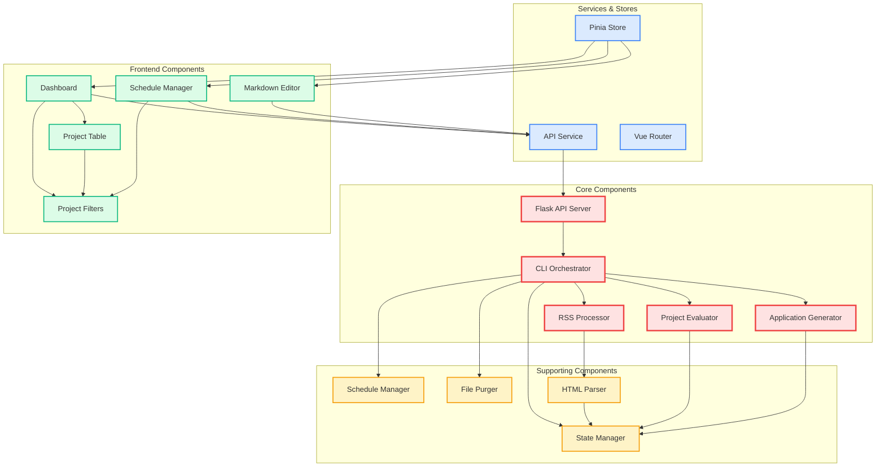

# Project-Bot Architecture Documentation

## High Level Architecture

```mermaid
graph TB
    %% Define styles
    classDef dataSource fill:#fef3c7,stroke:#f59e0b,stroke-width:2px,color:#92400e
    classDef backend fill:#dbeafe,stroke:#3b82f6,stroke-width:2px,color:#1e40af
    classDef frontend fill:#dcfce7,stroke:#10b981,stroke-width:2px,color:#166534
    classDef storage fill:#f3e8ff,stroke:#8b5cf6,stroke-width:2px,color:#7c3aed
    classDef main fill:#fee2e2,stroke:#ef4444,stroke-width:3px,color:#dc2626

    subgraph "📊 Data Sources"
        RSS[FreelancerMap RSS Feeds]
        CV["CV File (data/cv.md)"]
        Config["Configuration (config.yaml)"]
    end

    subgraph "⚙️ Backend (Python/Flask)"
        Server[server_enhanced.py<br/>Flask API Server]
        Main[main.py<br/>CLI Orchestrator]
        RSSHelper[rss_helper.py<br/>RSS Fetching & Processing]
        Evaluator[evaluate_projects.py<br/>Project Evaluation]
        Generator[application_generator.py<br/>Application Generation]
        StateMgr[state_manager.py<br/>State Management]
        Scheduler[scheduler_manager.py<br/>Automated Scheduling]
        Purger[file_purger.py<br/>Intelligent Purging]
    end

    subgraph "🖥️ Frontend (Vue.js + Vite)"
        Dashboard[Dashboard.vue<br/>Project Overview]
        ScheduleMgr[ScheduleManager.vue<br/>Schedule Management]
        MarkdownEditor[MarkdownEditor.vue<br/>Project Editing]
        Store[projects.js<br/>Pinia Store]
        API[api.js<br/>Axios HTTP Client]
    end

    subgraph "💾 Data Storage"
        Projects[projects/<br/>Markdown Files w/ YAML Frontmatter]
        Schedules[data/schedules.json]
        QuickFilters[data/quick_filters.json]
        Logs[logs/<br/>Application Logs]
    end

    RSS --> RSSHelper
    RSSHelper --> Projects
    Projects --> Evaluator
    Evaluator --> StateMgr
    StateMgr --> Generator
    Generator --> Projects
    Main --> RSSHelper
    Main --> Evaluator
    Main --> Generator
    Main --> StateMgr
    Main --> Scheduler
    Main --> Purger

    Dashboard --> API
    ScheduleMgr --> API
    MarkdownEditor --> API
    API --> Server
    Store --> Dashboard
    Store --> ScheduleMgr
    Store --> MarkdownEditor

    Scheduler --> Main
    Purger --> Projects
    Config --> Server
    Config --> Main
    CV --> Generator

    %% Apply styles
    class RSS,CV,Config dataSource
    class Server,Main,RSSHelper,Evaluator,Generator,StateMgr,Scheduler,Purger backend
    class Dashboard,ScheduleMgr,MarkdownEditor,Store,API frontend
    class Projects,Schedules,QuickFilters,Logs storage
```

### Architecture Overview

The Project-Bot is a comprehensive job application automation system consisting of:

- **Backend**: Python/Flask API server (server_enhanced.py) with core CLI orchestrator (main.py) for data processing, AI evaluation, application generation, and intelligent purging
- **Frontend**: Vue.js 3 + Vite web dashboard for project management, scheduling, and manual project creation/editing
- **Data Flow**: RSS scraping → Pre-evaluation → LLM analysis → State transitions → Automatic application generation → Dashboard synchronization
- **Scheduling**: APScheduler integration for automated workflow execution
- **Storage**: Markdown files with YAML frontmatter for projects, JSON for schedules and quick filters, file-based logs
- **Deployment**: Local development (separate backend/frontend servers) or Docker Compose for full-stack deployment

## Component Diagram

### Component Relationships

- **Flask API Server (server_enhanced.py)**: RESTful backend API handling frontend requests and CLI coordination
- **CLI Orchestrator (main.py)**: Central command-line interface for workflow execution
- **RSS Processor (rss_helper.py)**: Fetches and processes FreelancerMap RSS feeds
- **HTML Parser (parse_html.py)**: Extracts project details from HTML pages
- **Project Evaluator (evaluate_projects.py)**: AI-powered fit assessment using OpenAI/Anthropic/Google Gemini
- **Application Generator (application_generator.py)**: Generates professional German job applications
- **State Manager (state_manager.py)**: Tracks project lifecycle through 7 states with YAML frontmatter
- **File Purger (file_purger.py)**: Intelligent score-based cleanup of low-quality projects
- **Schedule Manager (scheduler_manager.py)**: APScheduler integration for automated runs
- **Frontend Components**: Vue.js 3 components for dashboard, scheduling, and project editing
- **API Services**: Axios-based HTTP client for frontend-backend communication
- **State Management**: Pinia store for reactive project data and quick filters

## Sequence Diagram: User Interaction

```mermaid
sequenceDiagram
    %% Define participant styles
    participant U as 👤 User
    participant F as 🖥️ Frontend (Vue.js)
    participant S as 📦 Pinia Store
    participant A as 🔗 API Client
    participant B as ⚙️ Backend (Flask API)
    participant P as 📄 Project Files
    participant SM as 🔄 State Manager

    %% Style definitions
    Note over U: User Actions
    Note over F,S: Frontend Layer
    Note over A: API Layer
    Note over B,SM: Backend Layer
    Note over P: Data Layer

    U->>+F: 🏠 Open Dashboard
    F->>+S: 🔄 Initialize Store
    S->>+A: 📋 fetchProjects()
    A->>+B: 🌐 GET /api/projects
    B->>+P: 📖 Read project files
    P-->>-B: 📊 Return project data
    B-->>-A: 📋 Return projects JSON
    A-->>-S: 💾 Update store
    S-->>-F: 🎨 Update UI
    F-->>-U: ✅ Dashboard loaded

    U->>+F: ⚡ Click "Generate Application"
    F->>+S: 🤖 generateApplication(projectId)
    S->>+A: 📤 POST /api/projects/{id}/generate
    A->>+B: 🚀 Generate application request
    B->>+SM: 📝 Update state to 'applied'
    SM-->>-B: ✅ State updated
    B->>B: 🧠 Call Application Generator
    B->>+P: 📖 Read project markdown
    P-->>-B: 📄 Return content
    B->>B: 🤖 Generate application (LLM)
    B->>+P: ✏️ Append application to markdown
    P-->>-B: 💾 File updated
    B->>+SM: 📝 Update state to 'applied'
    SM-->>-B: ✅ State updated
    B-->>-A: 🎉 Success response
    A-->>-S: 💾 Update store
    S-->>-F: 🔄 Refresh UI
    F-->>-U: ✅ Show success message
```

### User Interaction Flow

1. **Dashboard Loading**: User opens dashboard → Store fetches projects → API calls backend → Backend reads project files → Data displayed
2. **Application Generation**: User clicks generate → Store calls API → Backend updates state → Generates application using LLM → Appends to markdown → Updates state → UI refreshes
3. **State Transitions**: Manual state changes follow similar pattern through store → API → backend → state manager
4. **Scheduling**: User manages schedules through dedicated interface → API calls → Scheduler manager updates

## State Management Diagram

```mermaid
stateDiagram-v2
    %% Define state styles
    classDef initial fill:#e5e7eb,stroke:#6b7280,stroke-width:2px,color:#374151
    classDef processing fill:#dbeafe,stroke:#3b82f6,stroke-width:2px,color:#1e40af
    classDef rejected fill:#fee2e2,stroke:#ef4444,stroke-width:2px,color:#dc2626
    classDef accepted fill:#dcfce7,stroke:#10b981,stroke-width:2px,color:#166534
    classDef applied fill:#fef3c7,stroke:#f59e0b,stroke-width:2px,color:#92400e
    classDef sent fill:#f3e8ff,stroke:#8b5cf6,stroke-width:2px,color:#7c3aed
    classDef open fill:#e0f2fe,stroke:#06b6d4,stroke-width:2px,color:#0c4a6e
    classDef archived fill:#f3f4f6,stroke:#6b7280,stroke-width:2px,color:#374151

    [*] --> Scraped: 📥 RSS scraping

    Scraped --> Rejected: ❌ Pre-evaluation fails
    Scraped --> Accepted: ✅ Pre-evaluation passes

    Rejected --> Accepted: 🔄 Manual override
    Rejected --> Archived: 🗑️ Cleanup

    Accepted --> Applied: 🤖 Application generated
    Applied --> Sent: 📤 Application submitted
    Applied --> Archived: ⏰ Not sent

    Sent --> Open: 💬 Client communication
    Open --> Archived: 📋 Final state

    Archived --> [*]: 🧹 Cleanup

    note right of Scraped
        📊 Initial state after
        RSS processing
    end note

    note right of Rejected
        🚫 Failed evaluation
        criteria
    end note

    note right of Accepted
        🎯 Passed evaluation,
        ready for application
    end note

    note right of Applied
        📄 Application generated
        and attached
    end note

    note right of Sent
        ✉️ Application submitted
        to client
    end note

    note right of Open
        💼 Active client
        communication
    end note

    note right of Archived
        📦 Final state for
        cleanup and archiving
    end note

    %% Apply styles
    class Scraped processing
    class Rejected rejected
    class Accepted accepted
    class Applied applied
    class Sent sent
    class Open open
    class Archived archived
```

### State Management Details

- **Storage**: States stored in YAML frontmatter of markdown files
- **Transitions**: Automatic (evaluation results) and manual (user actions)
- **History**: Each state change logged with timestamp and optional notes
- **Validation**: State transitions validated against allowed transitions
- **Frontend**: Real-time state updates through Pinia store and API polling

## Scheduler Diagram

```mermaid
graph TB
    %% Define styles
    classDef scheduler fill:#fee2e2,stroke:#ef4444,stroke-width:3px,color:#dc2626
    classDef components fill:#dbeafe,stroke:#3b82f6,stroke-width:2px,color:#1e40af
    classDef workflows fill:#dcfce7,stroke:#10b981,stroke-width:2px,color:#166534
    classDef storage fill:#f3e8ff,stroke:#8b5cf6,stroke-width:2px,color:#7c3aed
    classDef frontend fill:#fef3c7,stroke:#f59e0b,stroke-width:2px,color:#92400e
    classDef triggers fill:#e0f2fe,stroke:#06b6d4,stroke-width:2px,color:#0c4a6e

    subgraph "⏰ Scheduler Components"
        APS[APScheduler<br/>Background Scheduler]
        SM[Scheduler Manager<br/>scheduler_manager.py]
        JobStore[Memory Job Store]
        Executor[ThreadPool Executor]
    end

    subgraph "🔄 Workflow Types"
        MainWF[Main Workflow<br/>main.py]
        EvalWF[Evaluate Workflow<br/>evaluate_projects.py]
        GenWF[Generate Workflow<br/>application_generator.py]
    end

    subgraph "💾 Schedule Storage"
        JSON[data/schedules.json]
    end

    subgraph "🖥️ Frontend Integration"
        ScheduleMgr[Schedule Manager<br/>ScheduleManager.vue]
        API[API Client<br/>api.js]
    end

    SM --> APS
    APS --> JobStore
    APS --> Executor

    SM --> JSON
    JSON --> SM

    APS --> MainWF
    APS --> EvalWF
    APS --> GenWF

    ScheduleMgr --> API
    API --> SM

    subgraph "⏰ Cron Triggers"
        CT1["0 9 * * 1-5<br/>📅 Mon-Fri 9:00"]
        CT2["0 */4 * * *<br/>🕐 Every 4 hours"]
        CT3["0 0 * * *<br/>🌙 Daily midnight"]
    end

    CT1 --> APS
    CT2 --> APS
    CT3 --> APS

    %% Apply styles
    class APS,SM scheduler
    class JobStore,Executor components
    class MainWF,EvalWF,GenWF workflows
    class JSON storage
    class ScheduleMgr,API frontend
    class CT1,CT2,CT3 triggers
```

### Scheduler Architecture

- **APScheduler**: Background job scheduling with timezone support
- **Job Storage**: In-memory with JSON persistence
- **Executors**: ThreadPool for concurrent job execution
- **Workflow Types**:
  - Main: Full scraping → evaluation → generation pipeline
  - Evaluate: Only evaluation phase
  - Generate: Only application generation for accepted projects
- **Frontend**: Vue.js interface for schedule CRUD operations
- **Triggers**: Cron-based scheduling with flexible timezones

## Data Flow Summary

1. **RSS Scraping**: FreelancerMap feeds → HTML parsing → Markdown files with YAML frontmatter
2. **Evaluation**: Pre-evaluation (keywords) → LLM analysis → State update
3. **Application Generation**: CV + project requirements → LLM generation → Markdown append
4. **State Management**: YAML frontmatter updates with history tracking
5. **Frontend Sync**: API endpoints → JSON responses → Pinia store updates
6. **Scheduling**: Cron triggers → Job execution → Automated workflows

## Key Technologies

- **Backend**: Python 3.12+, Flask, APScheduler, OpenAI/Anthropic/Google Gemini APIs
- **Frontend**: Vue.js 3.4+, Vite 5+, Pinia 2+, Axios, Tailwind CSS 3+, Vue Router
- **Data Storage**: Markdown files with YAML frontmatter (projects), JSON (schedules, quick filters), file-based logging
- **APIs**: RESTful Flask backend (/api/projects, /api/schedules), FreelancerMap RSS feeds
- **Build Tools**: Vite for frontend bundling, Docker Compose for deployment
- **Utilities**: server_control.sh (server management), docker-setup.sh (Docker setup)
- **Deployment**: Local (npm run dev + python server), Docker (docker-compose up)

This architecture provides a robust, automated job application system with comprehensive monitoring and manual override capabilities.

## Full Workflow Overview

```mermaid
flowchart TD
    %% Define styles
    classDef start fill:#e5e7eb,stroke:#6b7280,stroke-width:3px,color:#374151
    classDef process fill:#dbeafe,stroke:#3b82f6,stroke-width:2px,color:#1e40af
    classDef decision fill:#fef3c7,stroke:#f59e0b,stroke-width:2px,color:#92400e
    classDef success fill:#dcfce7,stroke:#10b981,stroke-width:2px,color:#166534
    classDef failure fill:#fee2e2,stroke:#ef4444,stroke-width:2px,color:#dc2626
    classDef storage fill:#f3e8ff,stroke:#8b5cf6,stroke-width:2px,color:#7c3aed
    classDef final fill:#f3f4f6,stroke:#6b7280,stroke-width:2px,color:#374151

    %% Start
    START([🚀 Start Project-Bot])

    %% RSS Processing Phase
    RSS[📡 Fetch RSS Feeds<br/>FreelancerMap]
    PARSE[🔍 Parse HTML Content<br/>Extract Project Data]
    SAVE[💾 Save as Markdown<br/>with YAML Frontmatter]
    STATE_INIT[📝 Initialize State<br/>'scraped']

    %% Evaluation Phase
    EVAL_START[🎯 Start Evaluation<br/>Process 'scraped' Projects]
    PRE_EVAL[⚡ Pre-Evaluation<br/>Keyword Filtering]
    PRE_DECISION{Pre-Eval<br/>Result?}
    LLM_EVAL[🤖 LLM Analysis<br/>AI Assessment]
    LLM_DECISION{LLM Eval<br/>Result?}

    %% Application Generation Phase
    ACCEPTED[✅ Mark as Accepted<br/>Ready for Generation]
    GEN_APP[✍️ Generate Application<br/>Using CV + Project]
    APPEND_MD[📄 Append to Markdown<br/>With Generation Details]
    UPDATE_STATE[📝 Update State<br/>'applied']

    %% Manual Actions
    MANUAL_OVERRIDE[🔄 Manual Override<br/>User Intervention]
    MANUAL_GEN[🎯 Manual Generation<br/>Specific Projects]

    %% Rejection Handling
    REJECTED[❌ Mark as Rejected<br/>Failed Criteria]
    ARCHIVE[📦 Move to Archive<br/>Cleanup]

    %% Final States
    SENT[📤 Application Sent<br/>Client Communication]
    OPEN[💬 Active Communication<br/>Ongoing]
    FINAL_ARCHIVE[🏁 Final Archive<br/>Complete]

    %% Automated Scheduling
    SCHEDULER[⏰ APScheduler<br/>Automated Runs]
    CRON_TRIGGERS[📅 Cron Triggers<br/>Scheduled Execution]

    %% Frontend Monitoring
    DASHBOARD[📊 Dashboard<br/>Real-time Monitoring]
    MANUAL_ACTIONS[🎮 Manual Actions<br/>User Controls]

    %% Flow connections
    START --> RSS
    RSS --> PARSE
    PARSE --> SAVE
    SAVE --> STATE_INIT
    STATE_INIT --> EVAL_START

    EVAL_START --> PRE_EVAL
    PRE_EVAL --> PRE_DECISION

    PRE_DECISION -->|❌ Fail| REJECTED
    PRE_DECISION -->|✅ Pass| LLM_EVAL

    LLM_EVAL --> LLM_DECISION
    LLM_DECISION -->|❌ Fail| REJECTED
    LLM_DECISION -->|✅ Pass| ACCEPTED

    ACCEPTED --> GEN_APP
    GEN_APP --> APPEND_MD
    APPEND_MD --> UPDATE_STATE

    UPDATE_STATE --> SENT
    SENT --> OPEN
    OPEN --> FINAL_ARCHIVE

    REJECTED --> ARCHIVE
    ARCHIVE --> FINAL_ARCHIVE

    %% Manual intervention paths
    STATE_INIT --> MANUAL_OVERRIDE
    MANUAL_OVERRIDE --> ACCEPTED
    MANUAL_OVERRIDE --> REJECTED

    UPDATE_STATE --> MANUAL_GEN
    MANUAL_GEN --> GEN_APP

    %% Scheduling integration
    SCHEDULER --> CRON_TRIGGERS
    CRON_TRIGGERS --> START

    %% Frontend integration
    STATE_INIT --> DASHBOARD
    UPDATE_STATE --> DASHBOARD
    DASHBOARD --> MANUAL_ACTIONS
    MANUAL_ACTIONS --> MANUAL_OVERRIDE
    MANUAL_ACTIONS --> MANUAL_GEN

    %% Apply styles
    class START start
    class RSS,PARSE,SAVE,STATE_INIT,EVAL_START,PRE_EVAL,LLM_EVAL,GEN_APP,APPEND_MD,UPDATE_STATE,SCHEDULER,CRON_TRIGGERS process
    class PRE_DECISION,LLM_DECISION decision
    class ACCEPTED,SENT,OPEN,DASHBOARD,MANUAL_ACTIONS success
    class REJECTED,ARCHIVE,FINAL_ARCHIVE failure
    class MANUAL_OVERRIDE,MANUAL_GEN storage
```

### Complete Workflow Description

The Project-Bot follows a comprehensive automated workflow with manual override capabilities:

#### 🔄 **Automated Flow:**
1. **Data Ingestion**: RSS feeds are fetched from FreelancerMap and parsed into structured markdown files
2. **State Initialization**: New projects are marked as 'scraped' with YAML frontmatter metadata
3. **Pre-Evaluation**: Keyword-based filtering removes obviously unsuitable projects
4. **LLM Evaluation**: AI analysis assesses project fit using CV and project requirements
5. **Application Generation**: Successful projects trigger automated application creation
6. **State Progression**: Projects move through states (applied → sent → open → archived)

#### 🎮 **Manual Intervention Points:**
- **Override Decisions**: Users can manually accept/reject projects at any stage
- **Manual Generation**: Force application generation for specific projects
- **State Management**: Direct state transitions through the dashboard interface

#### ⏰ **Scheduling Integration:**
- **Cron Triggers**: Automated execution at specified intervals
- **Workflow Types**: Main pipeline, evaluation-only, or generation-only runs
- **Background Processing**: Non-blocking execution with status monitoring

#### 📊 **Monitoring & Control:**
- **Real-time Dashboard**: Live project status and statistics
- **Manual Actions**: User controls for intervention and overrides
- **Audit Trail**: Complete history of state changes and actions

#### 🏁 **Final States:**
- **Archived**: Projects moved to long-term storage
- **Cleanup**: Automatic file purging based on retention policies
- **Reporting**: Comprehensive statistics and analytics

This architecture provides a robust foundation for automated job application management with comprehensive monitoring, manual overrides, and intelligent automation features.

## Deployment Diagram

```mermaid
graph TB
    %% Define styles
    classDef network fill:#e0f2fe,stroke:#06b6d4,stroke-width:2px,color:#0c4a6e
    classDef server fill:#dbeafe,stroke:#3b82f6,stroke-width:2px,color:#1e40af
    classDef client fill:#dcfce7,stroke:#10b981,stroke-width:2px,color:#166534
    classDef vpn fill:#fef3c7,stroke:#f59e0b,stroke-width:2px,color:#92400e

    subgraph "🌐 Internet"
        Tailscale[Tailscale VPN<br/>Secure Access]
    end

    subgraph "🏠 Home WLAN"
        Homeserver[Homeserver<br/>Docker Compose]

        subgraph "🐳 Docker Services"
            Backend[Backend<br/>Flask API]
            Frontend[Frontend<br/>Vue.js + Vite]
        end

        Laptop[Laptop<br/>Browser]
        Tablet[Tablet<br/>Browser]
        Smartphone[Smartphone<br/>Browser]
    end

    Tailscale --> Homeserver
    Homeserver --> Backend
    Homeserver --> Frontend
    Laptop --> Homeserver
    Tablet --> Homeserver
    Smartphone --> Homeserver
    Backend --> Frontend

    %% Apply styles
    class Tailscale vpn
    class Homeserver server
    class Backend,Frontend server
    class Laptop,Tablet,Smartphone client
```

### Deployment Architecture

The Project-Bot is deployed on a homeserver within the home WLAN using Docker Compose for containerized services. The frontend (Vue.js) and backend (Flask) run as separate containers, communicating internally.

Clients access the application through web browsers on various devices (laptop, tablet, smartphone) connected to the home network. For secure remote access from the internet, Tailscale VPN extends the home network, allowing encrypted connections without exposing ports directly to the internet.

This setup ensures secure, local deployment with optional remote access capabilities.

### Deployment Considerations
- **Local Development**: Separate processes for backend (python server_enhanced.py) and frontend (npm run dev)
- **Production**: Docker Compose for full-stack deployment with environment-specific configurations
- **Scaling**: ThreadPoolExecutor for concurrent evaluation and generation tasks
- **Monitoring**: Real-time dashboard updates via API polling and WebSocket potential
- **Data Persistence**: File-based with automatic backup and intelligent purging policies

The system is designed for reliability, with clear separation of concerns between CLI automation, API services, and web interface, enabling both headless operation and interactive use.