# Bewerbungs-Bot Architecture Documentation

## High Level Architecture

### Architecture Overview

The Bewerbungs-Bot is a comprehensive job application automation system consisting of:

- **Backend**: Python-based core system handling data processing, AI evaluation, and automation
- **Frontend**: Vue.js web interface for monitoring and manual control
- **Data Flow**: RSS scraping → AI evaluation → Application generation → State management
- **Scheduling**: Automated workflow execution using APScheduler
- **Storage**: File-based storage with YAML frontmatter for metadata

## Component Diagram

```mermaid
graph TB
    %% Define styles
    classDef core fill:#fee2e2,stroke:#ef4444,stroke-width:3px,color:#dc2626
    classDef supporting fill:#fef3c7,stroke:#f59e0b,stroke-width:2px,color:#92400e
    classDef frontend fill:#dcfce7,stroke:#10b981,stroke-width:2px,color:#166534
    classDef services fill:#dbeafe,stroke:#3b82f6,stroke-width:2px,color:#1e40af

    subgraph "🎯 Core Components"
        CLI[Command Line Interface<br/>main.py]
        RSSProcessor[RSS Processor<br/>rss_helper.py]
        ProjectEvaluator[Project Evaluator<br/>evaluate_projects.py]
        AppGenerator[Application Generator<br/>application_generator.py]
    end

    subgraph "🛠️ Supporting Components"
        StateManager[State Manager<br/>state_manager.py]
        ScheduleManager[Schedule Manager<br/>scheduler_manager.py]
        FilePurger[File Purger<br/>file_purger.py]
    end

    subgraph "🖥️ Frontend Components"
        DashboardComp[Dashboard Component<br/>Dashboard.vue]
        ScheduleComp[Schedule Manager<br/>ScheduleManager.vue]
        ProjectTable[Project Table<br/>ProjectTable.vue]
        ProjectFilters[Project Filters<br/>ProjectFilters.vue]
        ScheduleCard[Schedule Card<br/>ScheduleCard.vue]
    end

    subgraph "🔗 Services & Stores"
        APIClient[API Client<br/>api.js]
        PiniaStore[Pinia Store<br/>projects.js]
        AxiosClient[Axios HTTP Client]
    end

    CLI --> RSSProcessor
    CLI --> ProjectEvaluator
    CLI --> AppGenerator
    CLI --> StateManager
    CLI --> ScheduleManager
    CLI --> FilePurger

    RSSProcessor --> StateManager
    ProjectEvaluator --> StateManager
    AppGenerator --> StateManager

    DashboardComp --> APIClient
    ScheduleComp --> APIClient
    APIClient --> AxiosClient
    PiniaStore --> DashboardComp
    PiniaStore --> ScheduleComp

    DashboardComp --> ProjectTable
    DashboardComp --> ProjectFilters
    ScheduleComp --> ScheduleCard

    %% Apply styles
    class CLI,RSSProcessor,ProjectEvaluator,AppGenerator core
    class StateManager,ScheduleManager,FilePurger supporting
    class DashboardComp,ScheduleComp,ProjectTable,ProjectFilters,ScheduleCard frontend
    class APIClient,PiniaStore,AxiosClient services
```

### Component Relationships

- **CLI (main.py)**: Central orchestrator coordinating all backend operations
- **RSS Processor**: Handles external data ingestion from FreelancerMap
- **Project Evaluator**: AI-powered assessment using multiple LLM providers
- **Application Generator**: Automated job application creation
- **State Manager**: Maintains project lifecycle state
- **Schedule Manager**: Handles automated workflow execution
- **Frontend Components**: Vue.js components for user interaction
- **API Services**: RESTful communication between frontend and backend

## Sequence Diagram: User Interaction

```mermaid
sequenceDiagram
    %% Define participant styles
    participant U as 👤 User
    participant F as 🖥️ Frontend (Vue.js)
    participant S as 📦 Pinia Store
    participant A as 🔗 API Client
    participant B as ⚙️ Backend (Flask)
    participant P as 📄 Project Files
    participant SM as 🔄 State Manager

    %% Style definitions
    Note over U: User Actions
    Note over F,S: Frontend Layer
    Note over A: API Layer
    Note over B,SM: Backend Layer
    Note over P: Data Layer

    U->>+F: 🏠 Open Dashboard
    F->>+S: 🔄 Initialize Store
    S->>+A: 📋 fetchProjects()
    A->>+B: 🌐 GET /api/v1/projects
    B->>+P: 📖 Read project files
    P-->>-B: 📊 Return project data
    B-->>-A: 📋 Return projects JSON
    A-->>-S: 💾 Update store
    S-->>-F: 🎨 Update UI
    F-->>-U: ✅ Dashboard loaded

    U->>+F: ⚡ Click "Generate Application"
    F->>+S: 🤖 generateApplication(projectId)
    S->>+A: 📤 POST /api/v1/projects/{id}/generate
    A->>+B: 🚀 Generate application request
    B->>+SM: 📝 Update state to 'applied'
    SM-->>-B: ✅ State updated
    B->>B: 🧠 Call Application Generator
    B->>+P: 📖 Read project markdown
    P-->>-B: 📄 Return content
    B->>B: 🤖 Generate application (LLM)
    B->>+P: ✏️ Append application to markdown
    P-->>-B: 💾 File updated
    B->>+SM: 📝 Update state to 'applied'
    SM-->>-B: ✅ State updated
    B-->>-A: 🎉 Success response
    A-->>-S: 💾 Update store
    S-->>-F: 🔄 Refresh UI
    F-->>-U: ✅ Show success message
```

### User Interaction Flow

1. **Dashboard Loading**: User opens dashboard → Store fetches projects → API calls backend → Backend reads project files → Data displayed
2. **Application Generation**: User clicks generate → Store calls API → Backend updates state → Generates application using LLM → Appends to markdown → Updates state → UI refreshes
3. **State Transitions**: Manual state changes follow similar pattern through store → API → backend → state manager
4. **Scheduling**: User manages schedules through dedicated interface → API calls → Scheduler manager updates

## State Management Diagram

```mermaid
stateDiagram-v2
    %% Define state styles
    classDef initial fill:#e5e7eb,stroke:#6b7280,stroke-width:2px,color:#374151
    classDef processing fill:#dbeafe,stroke:#3b82f6,stroke-width:2px,color:#1e40af
    classDef rejected fill:#fee2e2,stroke:#ef4444,stroke-width:2px,color:#dc2626
    classDef accepted fill:#dcfce7,stroke:#10b981,stroke-width:2px,color:#166534
    classDef applied fill:#fef3c7,stroke:#f59e0b,stroke-width:2px,color:#92400e
    classDef sent fill:#f3e8ff,stroke:#8b5cf6,stroke-width:2px,color:#7c3aed
    classDef open fill:#e0f2fe,stroke:#06b6d4,stroke-width:2px,color:#0c4a6e
    classDef archived fill:#f3f4f6,stroke:#6b7280,stroke-width:2px,color:#374151

    [*] --> Scraped: 📥 RSS scraping

    Scraped --> Rejected: ❌ Pre-evaluation fails
    Scraped --> Accepted: ✅ Pre-evaluation passes

    Rejected --> Accepted: 🔄 Manual override
    Rejected --> Archived: 🗑️ Cleanup

    Accepted --> Applied: 🤖 Application generated
    Applied --> Sent: 📤 Application submitted
    Applied --> Archived: ⏰ Not sent

    Sent --> Open: 💬 Client communication
    Open --> Archived: 📋 Final state

    Archived --> [*]: 🧹 Cleanup

    note right of Scraped
        📊 Initial state after
        RSS processing
    end note

    note right of Rejected
        🚫 Failed evaluation
        criteria
    end note

    note right of Accepted
        🎯 Passed evaluation,
        ready for application
    end note

    note right of Applied
        📄 Application generated
        and attached
    end note

    note right of Sent
        ✉️ Application submitted
        to client
    end note

    note right of Open
        💼 Active client
        communication
    end note

    note right of Archived
        📦 Final state for
        cleanup and archiving
    end note

    %% Apply styles
    class Scraped processing
    class Rejected rejected
    class Accepted accepted
    class Applied applied
    class Sent sent
    class Open open
    class Archived archived
```

### State Management Details

- **Storage**: States stored in YAML frontmatter of markdown files
- **Transitions**: Automatic (evaluation results) and manual (user actions)
- **History**: Each state change logged with timestamp and optional notes
- **Validation**: State transitions validated against allowed transitions
- **Frontend**: Real-time state updates through Pinia store and API polling

## Scheduler Diagram

```mermaid
graph TB
    %% Define styles
    classDef scheduler fill:#fee2e2,stroke:#ef4444,stroke-width:3px,color:#dc2626
    classDef components fill:#dbeafe,stroke:#3b82f6,stroke-width:2px,color:#1e40af
    classDef workflows fill:#dcfce7,stroke:#10b981,stroke-width:2px,color:#166534
    classDef storage fill:#f3e8ff,stroke:#8b5cf6,stroke-width:2px,color:#7c3aed
    classDef frontend fill:#fef3c7,stroke:#f59e0b,stroke-width:2px,color:#92400e
    classDef triggers fill:#e0f2fe,stroke:#06b6d4,stroke-width:2px,color:#0c4a6e

    subgraph "⏰ Scheduler Components"
        APS[APScheduler<br/>Background Scheduler]
        SM[Scheduler Manager<br/>scheduler_manager.py]
        JobStore[Memory Job Store]
        Executor[ThreadPool Executor]
    end

    subgraph "🔄 Workflow Types"
        MainWF[Main Workflow<br/>main.py]
        EvalWF[Evaluate Workflow<br/>evaluate_projects.py]
        GenWF[Generate Workflow<br/>application_generator.py]
    end

    subgraph "💾 Schedule Storage"
        JSON[data/schedules.json]
    end

    subgraph "🖥️ Frontend Integration"
        ScheduleMgr[Schedule Manager<br/>ScheduleManager.vue]
        API[API Client<br/>api.js]
    end

    SM --> APS
    APS --> JobStore
    APS --> Executor

    SM --> JSON
    JSON --> SM

    APS --> MainWF
    APS --> EvalWF
    APS --> GenWF

    ScheduleMgr --> API
    API --> SM

    subgraph "⏰ Cron Triggers"
        CT1["0 9 * * 1-5<br/>📅 Mon-Fri 9:00"]
        CT2["0 */4 * * *<br/>🕐 Every 4 hours"]
        CT3["0 0 * * *<br/>🌙 Daily midnight"]
    end

    CT1 --> APS
    CT2 --> APS
    CT3 --> APS

    %% Apply styles
    class APS,SM scheduler
    class JobStore,Executor components
    class MainWF,EvalWF,GenWF workflows
    class JSON storage
    class ScheduleMgr,API frontend
    class CT1,CT2,CT3 triggers
```

### Scheduler Architecture

- **APScheduler**: Background job scheduling with timezone support
- **Job Storage**: In-memory with JSON persistence
- **Executors**: ThreadPool for concurrent job execution
- **Workflow Types**:
  - Main: Full scraping → evaluation → generation pipeline
  - Evaluate: Only evaluation phase
  - Generate: Only application generation for accepted projects
- **Frontend**: Vue.js interface for schedule CRUD operations
- **Triggers**: Cron-based scheduling with flexible timezones

## Data Flow Summary

1. **RSS Scraping**: FreelancerMap feeds → HTML parsing → Markdown files with YAML frontmatter
2. **Evaluation**: Pre-evaluation (keywords) → LLM analysis → State update
3. **Application Generation**: CV + project requirements → LLM generation → Markdown append
4. **State Management**: YAML frontmatter updates with history tracking
5. **Frontend Sync**: API endpoints → JSON responses → Pinia store updates
6. **Scheduling**: Cron triggers → Job execution → Automated workflows

## Key Technologies

- **Backend**: Python 3, APScheduler, Anthropic/OpenAI/Google AI
- **Frontend**: Vue.js 3, Pinia, Axios, Tailwind CSS
- **Data**: Markdown files with YAML frontmatter, JSON configuration
- **APIs**: RESTful Flask API, RSS feed consumption
- **Deployment**: Docker support, server control scripts

This architecture provides a robust, automated job application system with comprehensive monitoring and manual override capabilities.

## Full Workflow Overview

### Complete Workflow Description

The Bewerbungs-Bot follows a comprehensive automated workflow with manual override capabilities:

#### 🔄 **Automated Flow:**
1. **Data Ingestion**: RSS feeds are fetched from FreelancerMap and parsed into structured markdown files
2. **State Initialization**: New projects are marked as 'scraped' with YAML frontmatter metadata
3. **Pre-Evaluation**: Keyword-based filtering removes obviously unsuitable projects
4. **LLM Evaluation**: AI analysis assesses project fit using CV and project requirements
5. **Application Generation**: Successful projects trigger automated application creation
6. **State Progression**: Projects move through states (applied → sent → open → archived)

#### 🎮 **Manual Intervention Points:**
- **Override Decisions**: Users can manually accept/reject projects at any stage
- **Manual Generation**: Force application generation for specific projects
- **State Management**: Direct state transitions through the dashboard interface

#### ⏰ **Scheduling Integration:**
- **Cron Triggers**: Automated execution at specified intervals
- **Workflow Types**: Main pipeline, evaluation-only, or generation-only runs
- **Background Processing**: Non-blocking execution with status monitoring

#### 📊 **Monitoring & Control:**
- **Real-time Dashboard**: Live project status and statistics
- **Manual Actions**: User controls for intervention and overrides
- **Audit Trail**: Complete history of state changes and actions

#### 🏁 **Final States:**
- **Archived**: Projects moved to long-term storage
- **Cleanup**: Automatic file purging based on retention policies
- **Reporting**: Comprehensive statistics and analytics

This workflow ensures maximum automation while providing full manual control when needed, creating an efficient and flexible job application management system.