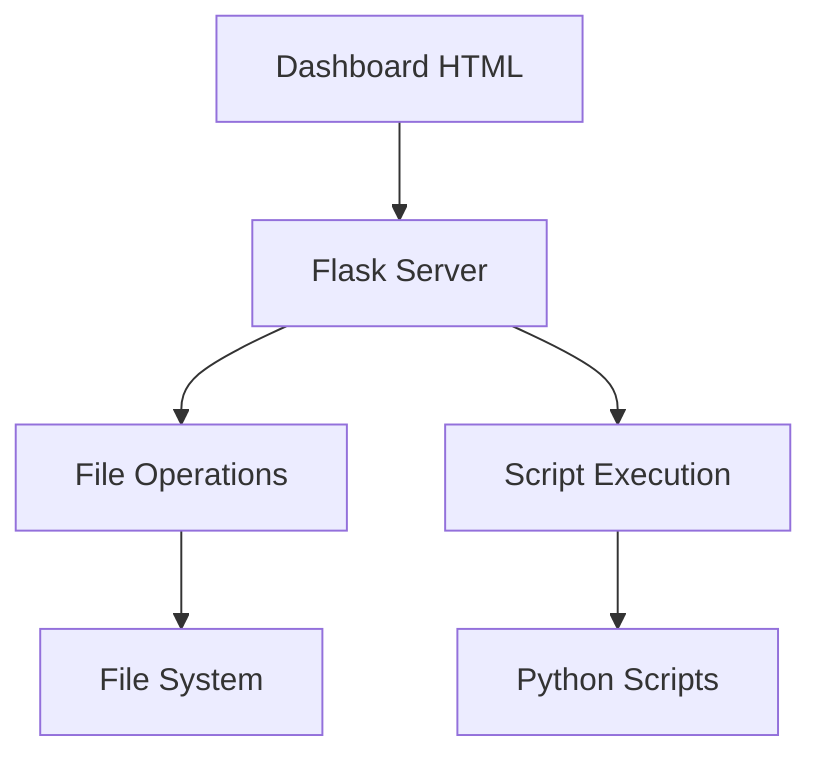

# Dynamic Dashboard Architecture Plan

## Solution: Flask + Simple REST APIs

A lightweight Flask backend with RESTful APIs for simple file operations and script execution while preserving your existing Python workflow.

## Architecture



## Implementation Phases

### Phase 1: Basic Server Setup (2-3 hours)

**Create `server.py` with Flask app:**
```python
from flask import Flask, jsonify, request, send_from_directory
import subprocess
import os
import shutil
from pathlib import Path

app = Flask(__name__)

@app.route('/api/move-project', methods=['POST'])
def move_project():
    # Move project between folders (accepted/rejected/applied)
    
@app.route('/api/execute-script', methods=['POST'])
def execute_script():
    # Run main.py, evaluate_projects.py, etc.
    
@app.route('/')
def dashboard():
    return send_from_directory('dashboard', 'dashboard.html')

if __name__ == '__main__':
    app.run(debug=True, port=5000)
```

**Add file operation endpoints:**
- Move projects between folders
- Validate file paths for security
- Return success/error responses

**Add script execution endpoints:**
- Execute [`main.py`](main.py:1), [`evaluate_projects.py`](evaluate_projects.py:1), [`application_generator.py`](application_generator.py:1)
- Handle script parameters
- Return execution results

**Serve existing dashboard:**
- Serve current [`dashboard/dashboard.html`](dashboard/dashboard.html:1) without changes
- Test Flask server functionality

### Phase 2: API Integration (2-4 hours)

**Update dashboard HTML with API client:**
```javascript
class DashboardAPI {
    async moveProject(projectId, fromStatus, toStatus) {
        const response = await fetch('/api/move-project', {
            method: 'POST',
            headers: { 'Content-Type': 'application/json' },
            body: JSON.stringify({ projectId, fromStatus, toStatus })
        });
        return response.json();
    }
    
    async executeScript(scriptName, params = {}) {
        const response = await fetch('/api/execute-script', {
            method: 'POST',
            headers: { 'Content-Type': 'application/json' },
            body: JSON.stringify({ script: scriptName, params })
        });
        return response.json();
    }
}
```

**Add move buttons to project rows:**
- `Accepted → Applied` buttons
- `Rejected → Accepted` buttons
- Update project status in UI after move

**Add script execution buttons:**
- Re-evaluate specific projects
- Generate applications
- Refresh dashboard data

**Handle success/error responses:**
- Show loading indicators during operations
- Display success/error messages
- Update UI after operations complete

## Project Structure
```
bewerbungs-bot/
├── server.py                 # New Flask backend
├── dashboard/
│   ├── dashboard.html        # Enhanced with API calls
│   └── generate_dashboard_data.py
├── main.py                   # Existing (unchanged)
├── evaluate_projects.py      # Existing (unchanged)
├── application_generator.py  # Existing (unchanged)
└── requirements.txt          # Add Flask dependency
```

## API Endpoints

**File Operations:**
```bash
POST /api/move-project
{
  "projectId": "project_123",
  "fromStatus": "accepted",
  "toStatus": "applied"
}
```

**Script Execution:**
```bash
POST /api/execute-script
{
  "script": "evaluate_projects",
  "params": {"threshold": 85}
}
```

## Setup

**Install Flask:**
```bash
pip install flask
```

**Run development server:**
```bash
python server.py
# Access at http://localhost:5000
```

This focused implementation delivers dynamic file operations and script execution with minimal complexity.