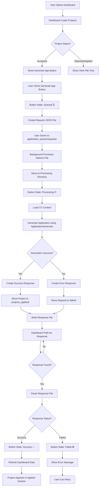
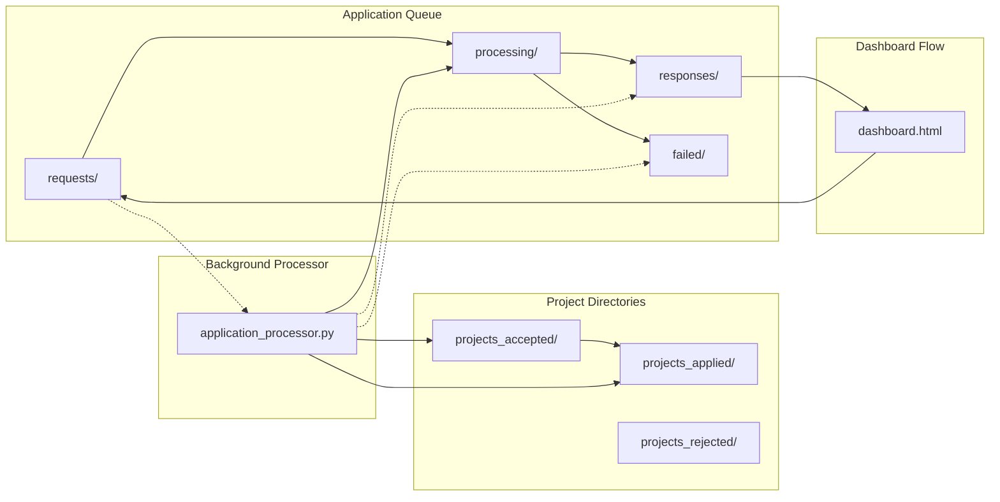
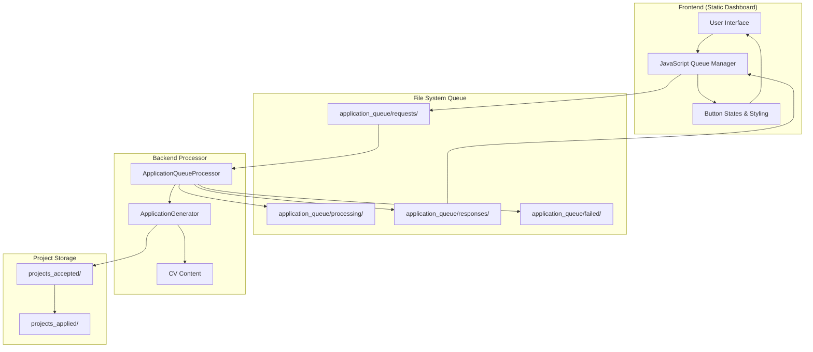
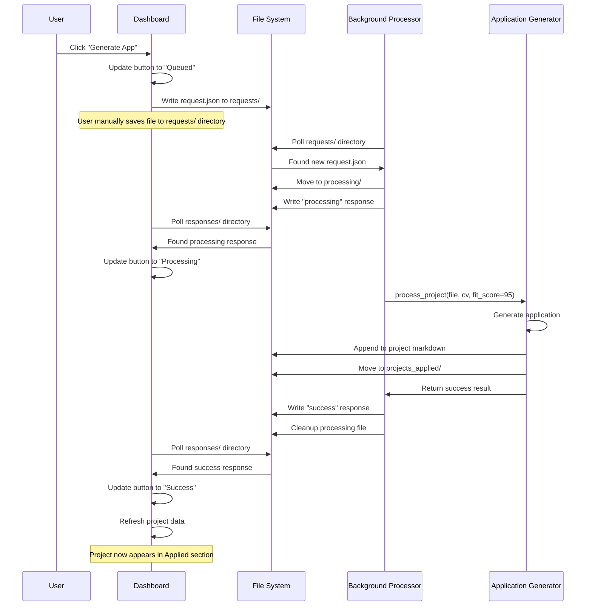
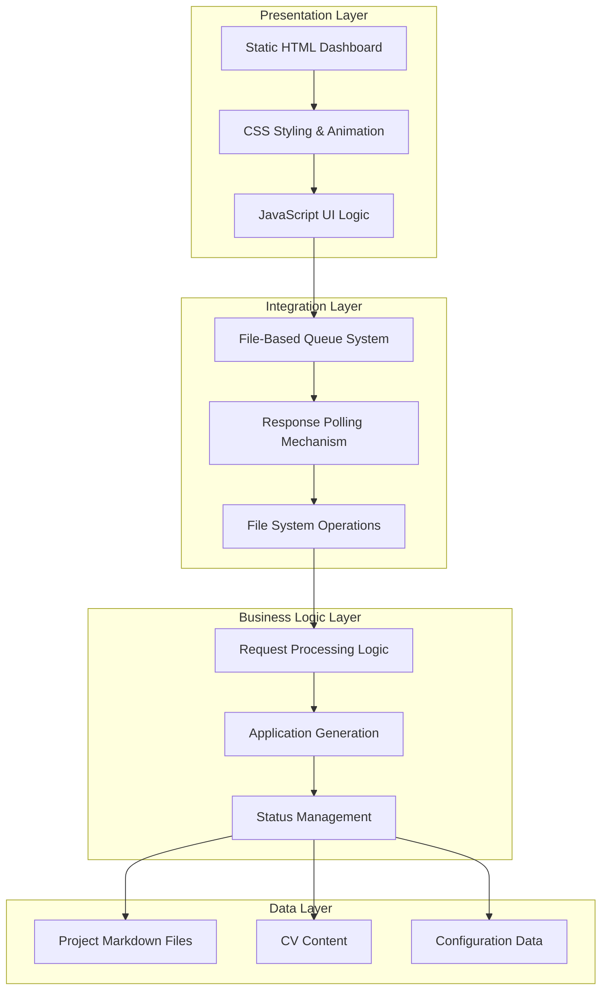

# Dashboard Application Generation - System Flow Diagrams

## Complete Workflow Diagram



## Directory Flow Diagram



## Button State Flow

```mermaid
stateDiagram-v2
    [*] --> Default: Project is Accepted
    Default --> Queued: User clicks Generate
    Queued --> Processing: Processor picks up request
    Processing --> Success: Application generated successfully
    Processing --> Failed: Generation error
    Success --> [*]: Process complete
    Failed --> Default: User can retry
    
    note right of Default
        Blue button
        "Generate App"
    end note
    
    note right of Queued
        Yellow button
        "Queued..."
    end note
    
    note right of Processing
        Gray button with spinner
        "Processing ⟳"
    end note
    
    note right of Success
        Green button
        "Success ✅"
    end note
    
    note right of Failed
        Red button
        "Failed ❌"
    end note
```

## Data Flow Architecture



## Component Interaction Sequence



## Technical Architecture Layers



## Benefits Summary

### ✅ Static Dashboard Maintained
- No server required
- Works offline
- Simple deployment (open HTML file)
- Fast performance

### ✅ Robust Processing
- Atomic file operations
- Error recovery and retry
- Full audit trail
- Handles system crashes gracefully

### ✅ Real-time User Feedback
- Button states show progress
- Immediate visual feedback
- Error messages displayed
- Auto-refresh on completion

### ✅ Scalable Architecture
- Multiple processors can run
- Queue handles high volume
- Easy to extend with new actions
- Clean separation of concerns

## Implementation Complexity: Medium
- **Frontend**: JavaScript file operations, polling, UI updates
- **Backend**: File monitoring, queue processing, integration
- **Integration**: Atomic file operations, error handling
- **Testing**: End-to-end workflows, error scenarios

## Estimated Timeline: 8-10 hours
1. **Queue System Setup**: 1-2 hours
2. **Background Processor**: 2-3 hours  
3. **Dashboard Enhancement**: 2-3 hours
4. **Integration & Testing**: 2-3 hours

This architecture maintains your static dashboard philosophy while providing powerful application generation capabilities through an elegant file-based queue system.