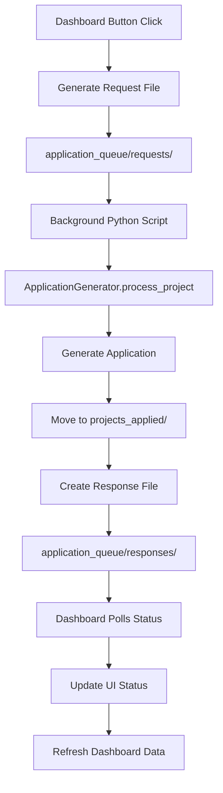

# Dashboard Application Generation Implementation Plan

## Overview
Add application generation buttons to the dashboard using a file-based queue system that maintains the static nature of the dashboard while enabling seamless background processing.

## Architecture: File-Based Queue System

### System Flow


### Benefits of File-Based Queue Approach
- ✅ **Maintains Static Nature** - No server required for dashboard
- ✅ **Reliable Processing** - Atomic file operations prevent corruption
- ✅ **Real-time Feedback** - Dashboard polls for status updates
- ✅ **Scalable & Robust** - Multiple processors can watch the same queue
- ✅ **Audit Trail** - Full history of all operations

## Implementation Todo List

### Phase 1: Queue System Foundation (1-2 hours)

#### 1.1 Create Queue Directory Structure
- [ ] Create `application_queue/` directory structure:
  - [ ] `application_queue/requests/` - JSON request files from dashboard
  - [ ] `application_queue/responses/` - JSON response files from processor  
  - [ ] `application_queue/processing/` - Files currently being processed
  - [ ] `application_queue/failed/` - Failed requests for retry
- [ ] Add `.gitignore` entries for queue directories (except structure)

#### 1.2 Define Data Formats

**Request File Format:**
```json
{
  "request_id": "20250828_131558_generate_app",
  "timestamp": "2025-08-28T13:15:58Z",
  "project_id": "20250828_113258_Cloud_Engineer,_Software_Developer",
  "project_file": "projects_accepted/20250828_113258_Cloud_Engineer,_Software_Developer.md",
  "action": "generate_application",
  "user_agent": "dashboard-v1.0"
}
```

**Response File Format:**
```json
{
  "request_id": "20250828_131558_generate_app",
  "timestamp": "2025-08-28T13:16:23Z",
  "status": "success|processing|failed",
  "project_id": "20250828_113258_Cloud_Engineer,_Software_Developer",
  "result": {
    "application_generated": true,
    "tokens_used": 1250,
    "cost": 0.0125,
    "moved_to_applied": true,
    "new_location": "projects_applied/20250828_113258_Cloud_Engineer,_Software_Developer.md"
  },
  "error": null
}
```

### Phase 2: Background Processor (2-3 hours)

#### 2.1 Create `application_processor.py`
- [ ] **Main processor class `ApplicationQueueProcessor`**:
  - [ ] Initialize with config and ApplicationGenerator
  - [ ] Set up queue directory paths
  - [ ] Load CV content for processing
- [ ] **Core processing methods**:
  - [ ] `process_queue()` - Main infinite loop
  - [ ] `process_request()` - Handle single request file
  - [ ] `generate_application()` - Use ApplicationGenerator
  - [ ] `create_response()` - Write response files
- [ ] **Error handling & recovery**:
  - [ ] Move failed requests to failed/ directory
  - [ ] Log processing errors
  - [ ] Retry mechanism for failed requests

#### 2.2 Request Processing Logic
- [ ] **Atomic file operations**:
  - [ ] Move request from requests/ to processing/
  - [ ] Process application generation
  - [ ] Create response file
  - [ ] Clean up processing file
- [ ] **Status management**:
  - [ ] Create "processing" status immediately
  - [ ] Update with "success" or "failed" status
  - [ ] Include detailed result information

#### 2.3 Integration with Existing ApplicationGenerator
- [ ] Use existing `ApplicationGenerator.process_project()` method
- [ ] Pass CV content and high fit score (95) for manual generation
- [ ] Handle all existing functionality (file moving, markdown updates)

### Phase 3: Dashboard Enhancement (2-3 hours)

#### 3.1 Add Action Buttons to Dashboard HTML
- [ ] **Update table structure in `dashboard.html`**:
  - [ ] Modify Actions column to include generation buttons
  - [ ] Add buttons only for "accepted" status projects
  - [ ] Include both "View File" and "Generate App" actions

#### 3.2 Button States & Styling
- [ ] **CSS for button states**:
  - [ ] Default: Blue "Generate App" button
  - [ ] Queued: Yellow "Queued" state
  - [ ] Processing: Gray "Processing" with spinner
  - [ ] Success: Green "Success" state
  - [ ] Failed: Red "Failed" state
- [ ] **Responsive design** for action buttons

#### 3.3 JavaScript Queue Interface
- [ ] **ApplicationQueue class**:
  - [ ] `generateApplication()` - Create request file
  - [ ] `writeRequestFile()` - Use File System Access API or download
  - [ ] `trackRequest()` - Track active requests
  - [ ] `updateButtonState()` - Update button appearance
- [ ] **Status polling system**:
  - [ ] Poll response directory every 2 seconds
  - [ ] Update button states based on responses
  - [ ] Handle request completion and errors

#### 3.4 File System Integration
- [ ] **Request file creation**:
  - [ ] Generate unique request IDs
  - [ ] Create downloadable JSON files
  - [ ] Use browser download mechanism to save to queue
- [ ] **Response file monitoring**:
  - [ ] Method to check for response files
  - [ ] Parse response JSON and update UI
  - [ ] Clean up old response files

### Phase 4: User Experience & Integration (1-2 hours)

#### 4.1 Enhanced Dashboard Data Generation
- [ ] **Update `generate_dashboard_data.py`**:
  - [ ] Include queue status information
  - [ ] Mark projects that have pending requests
  - [ ] Add application generation metadata

#### 4.2 User Feedback & Notifications
- [ ] **Visual feedback system**:
  - [ ] Success notifications when applications generated
  - [ ] Error messages for failed generations
  - [ ] Progress indicators during processing
- [ ] **Request status display**:
  - [ ] Show active requests count
  - [ ] Display processing queue length
  - [ ] Recent activity log

#### 4.3 Dashboard Data Refresh
- [ ] **Auto-refresh mechanism**:
  - [ ] Refresh dashboard data after successful generation
  - [ ] Update project counts and statistics
  - [ ] Move generated projects to "Applied" section

### Phase 5: Testing & Documentation (1 hour)

#### 5.1 Integration Testing
- [ ] **End-to-end workflow testing**:
  - [ ] Test button click → request creation
  - [ ] Test background processing
  - [ ] Test status updates in dashboard
  - [ ] Test error handling scenarios

#### 5.2 Documentation Updates
- [ ] **Update README.md**:
  - [ ] Document new application generation workflow
  - [ ] Add background processor setup instructions
  - [ ] Update dashboard usage guide
- [ ] **Update dashboard_guide.md**:
  - [ ] Add queue system architecture
  - [ ] Document new button functionality

## File Structure Changes

```
bewerbungs-bot/
├── application_queue/           # NEW: Queue system
│   ├── requests/               # Request files from dashboard
│   ├── responses/              # Response files from processor
│   ├── processing/             # Files being processed
│   ├── failed/                # Failed requests
│   └── .gitkeep               # Keep empty directories
├── dashboard/
│   ├── dashboard.html         # ENHANCED: Add generation buttons
│   └── generate_dashboard_data.py
├── application_processor.py    # NEW: Background processor
├── main.py                    # UPDATE: Add processor start option
└── README.md                  # UPDATE: Document new workflow
```

## Usage Workflow

### For Users:
1. **Open Dashboard** → View projects in browser
2. **Click "Generate App"** → Button shows "Queued" state  
3. **Background Processing** → Button shows "Processing" with spinner
4. **Application Generated** → Button shows "Success", project moves to Applied
5. **Dashboard Refreshes** → Updated data with new application

### For Developers:
1. **Start Background Processor**: `python application_processor.py`
2. **Open Dashboard**: Open `dashboard/dashboard.html` in browser
3. **Monitor Queue**: Check `application_queue/` directories for activity
4. **View Results**: Generated applications in `projects_applied/` folder

## Implementation Priority

1. **Phase 1** (High Priority): Queue system foundation - enables basic functionality
2. **Phase 2** (High Priority): Background processor - core processing logic  
3. **Phase 3** (High Priority): Dashboard buttons - user interface
4. **Phase 4** (Medium Priority): User experience improvements
5. **Phase 5** (Low Priority): Testing and documentation

## Success Criteria

- ✅ Dashboard displays "Generate App" buttons for accepted projects
- ✅ Clicking button queues application generation request
- ✅ Background processor generates applications automatically
- ✅ Button states update in real-time to show progress
- ✅ Generated applications appear in projects_applied/ folder
- ✅ Dashboard refreshes to show updated project status
- ✅ Error handling works for failed generations
- ✅ No server required - maintains static dashboard nature

## Technical Considerations

### Security
- File-based queue is safe and local-only
- No network requests or external dependencies
- User controls all file operations

### Performance  
- Minimal impact on dashboard load time
- Background processing doesn't block UI
- Polling frequency can be adjusted for performance

### Scalability
- Multiple processor instances can run simultaneously  
- Queue handles high volumes of requests
- Failed requests can be retried automatically

### Maintainability
- Clean separation between UI and processing
- Leverages existing ApplicationGenerator code
- Easy to extend with additional actions