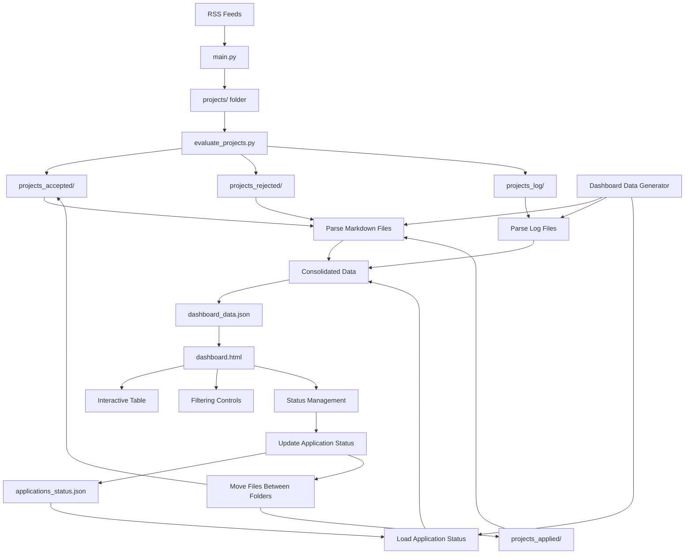

# Dashboard System Architecture

## Data Flow Diagram



## Component Architecture

### 1. Data Sources
- **Project Files**: Markdown files in `projects_accepted/` and `projects_rejected/`
- **Log Files**: Evaluation logs in `projects_log/` containing scores and rationales
- **Application Status**: JSON metadata tracking application submissions

### 2. Data Processing Layer
```python
# generate_dashboard_data.py
class DashboardDataGenerator:
    def extract_project_metadata()
    def parse_log_scores()
    def load_application_status()
    def generate_consolidated_json()
```

### 3. Dashboard Interface Layer
```html
<!-- dashboard.html -->
- Static HTML with embedded CSS and JavaScript
- No external dependencies
- Self-contained and portable
```

### 4. Application Status Management
```json
// applications_status.json
{
  "applications": {
    "project_id": {
      "applied_date": "2025-08-28",
      "notes": "Applied via company website",
      "status": "pending"
    }
  }
}
```

## File System Structure

```
bewerbungs-bot/
├── main.py                     # Project scraping
├── evaluate_projects.py        # Project evaluation
├── config.yaml                 # Configuration
├── cv.md                       # CV file
├── 
├── projects/                   # Scraped projects (temporary)
├── projects_accepted/          # Accepted projects
├── projects_rejected/          # Rejected projects
├── projects_applied/           # Applied projects (NEW)
├── projects_log/               # Evaluation logs
├── 
├── dashboard/                  # Dashboard system (NEW)
│   ├── dashboard.html          # Main interface
│   ├── generate_dashboard_data.py  # Data extraction
│   ├── dashboard_data.json     # Generated data
│   └── README.md               # Documentation
├── 
├── applications_status.json    # Application tracking (NEW)
├── update_dashboard.py         # Convenience script (NEW)
├── 
├── dashboard_plan.md           # This planning document
└── dashboard_todo.md           # Implementation checklist
```

## Technology Stack

### Backend (Data Processing)
- **Python 3.7+** for data extraction and processing
- **JSON** for data serialization
- **Regular Expressions** for log parsing
- **File System Operations** for project management

### Frontend (Dashboard Interface)
- **HTML5** semantic structure
- **CSS3** with Flexbox/Grid for responsive design
- **Vanilla JavaScript (ES6+)** for all interactions
- **Local Storage** for user preferences
- **File API** for CSV export functionality

## Security & Performance Considerations

### Security
- ✅ **No server required** - eliminates server-side vulnerabilities
- ✅ **Local file access only** - no network requests
- ✅ **No external dependencies** - no CDN or third-party risks
- ✅ **Static content** - no dynamic code execution

### Performance
- ✅ **JSON data loading** - fast parsing and rendering
- ✅ **Client-side filtering** - instant response times
- ✅ **Minimal DOM manipulation** - efficient table updates
- ✅ **Lazy rendering** - handle large datasets efficiently

## Integration Points

### With Existing Workflow
1. **Data Generation**: Can be triggered after each evaluation batch
2. **Status Updates**: Dashboard updates feed back to file system
3. **File Management**: Seamless integration with existing folder structure

### Automation Possibilities
```python
# Example integration in evaluate_projects.py
def main():
    # ... existing evaluation logic ...
    
    # Auto-update dashboard after batch processing
    if args.update_dashboard:
        from dashboard.generate_dashboard_data import update_dashboard_data
        update_dashboard_data()
```

## Deployment & Usage

### Setup
1. Run `python dashboard/generate_dashboard_data.py` to create initial data
2. Open `dashboard/dashboard.html` in any modern browser
3. No additional setup or server configuration required

### Updates
1. **Manual**: Re-run data generation script when needed
2. **Automatic**: Integrate with existing evaluation workflow
3. **On-demand**: Use `update_dashboard.py` convenience script

### Browser Compatibility
- **Chrome 60+** ✅
- **Firefox 55+** ✅  
- **Safari 12+** ✅
- **Edge 79+** ✅

## Scalability Considerations

### Data Volume
- **Current**: ~50-100 projects - instant loading
- **Future**: 1000+ projects - may need pagination or virtual scrolling
- **Storage**: JSON file approach scales to thousands of records

### Feature Extensions
- **Export formats**: Easy to add PDF, Excel export
- **Advanced filtering**: Can add complex query builders
- **Data visualization**: Charts and graphs can be added
- **Mobile app**: Core logic can be adapted for mobile platforms