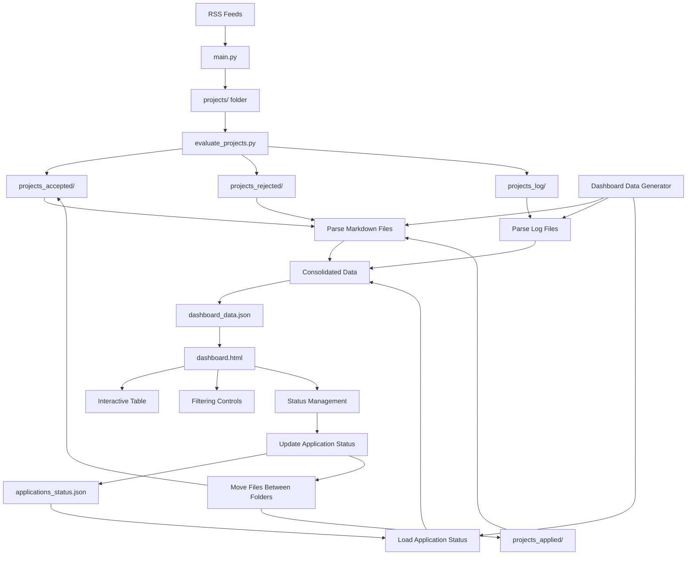

# Dashboard System - Complete Guide

## Overview
A static HTML dashboard for monitoring job application processing with no server requirements. The dashboard displays projects in a sortable table with comprehensive filtering capabilities and application status tracking.

## Architecture

### Data Flow Diagram



### System Components

#### 1. Data Collection Layer
**Script: `dashboard/generate_dashboard_data.py`**
- Parse all project files from `projects_accepted/`, `projects_rejected/`, and `projects_applied/`
- Extract metadata from markdown files (Eingestellt date, project details)
- Parse log files to extract pre-evaluation and LLM scores
- Create consolidated JSON data file for dashboard consumption

#### 2. Application Status Tracking
- `projects_applied/` folder for projects where applications have been submitted
- `applications_status.json` metadata file to track application dates and details
- Dashboard interface to mark accepted projects as "applied"

#### 3. Static Dashboard Interface
**File: `dashboard/dashboard.html`**
- Self-contained HTML file with embedded CSS and JavaScript
- No external dependencies or server requirements
- Responsive design for different screen sizes

### File System Structure

```
bewerbungs-bot/
├── main.py                     # Project scraping
├── evaluate_projects.py        # Project evaluation
├── config.yaml                 # Configuration
├── cv.md                       # CV file
├── 
├── projects/                   # Scraped projects (temporary)
├── projects_accepted/          # Accepted projects
├── projects_rejected/          # Rejected projects
├── projects_applied/           # Applied projects
├── projects_log/               # Evaluation logs
├── 
├── dashboard/                  # Dashboard system
│   ├── dashboard.html          # Main interface
│   ├── generate_dashboard_data.py  # Data extraction
│   └── dashboard_data.json     # Generated data
├── 
├── applications_status.json    # Application tracking
├── update_dashboard.py         # Convenience script
└── dashboard_guide.md          # This documentation
```

## Dashboard Features

### Data Table Columns
1. **Retrieval Date** - Extracted from filename timestamp
2. **Eingestellt Date** - Parsed from markdown "Eingestellt:" field
3. **Project Title** - From markdown header
4. **Pre-eval Score** - From log files
5. **LLM Score** - From log files (when available)
6. **Status** - Rejected/Accepted/Applied
7. **File Link** - Direct link to markdown file
8. **Actions** - Mark as Applied button (for accepted projects)

### Filtering & Sorting
- **Sortable columns** - Click any column header to sort
- **Status filters** - Checkboxes for Rejected/Accepted/Applied
- **Date range filters**:
  - Date picker inputs for custom ranges
  - Dropdown presets: Last 3 days, Last week, Last 2 weeks, Last month
- **Search box** - Full-text search across project titles

### Interactive Features
- **Mark as Applied** - Button to move projects from accepted to applied status
- **Quick stats** - Summary cards showing counts by status
- **Export functionality** - Download filtered data as CSV

## Technical Stack

### Backend (Data Processing)
- **Python 3.7+** for data extraction and processing
- **JSON** for data serialization
- **Regular Expressions** for log parsing
- **File System Operations** for project management

### Frontend (Dashboard Interface)
- **HTML5** semantic structure
- **CSS3** with Flexbox/Grid for responsive design
- **Vanilla JavaScript (ES6+)** for all interactions
- **Local Storage** for user preferences
- **File API** for CSV export functionality

## Data Format Specification

```json
{
  "projects": [
    {
      "id": "20250827_105150_ANÜ...",
      "title": "IT Solution Architect - AWS",
      "retrieval_date": "2025-08-27T10:51:50",
      "eingestellt_date": "2025-08-27",
      "pre_eval_score": 17,
      "llm_score": 85,
      "status": "accepted",
      "file_path": "projects_accepted/...",
      "url": "https://...",
      "company": "berater.de GmbH",
      "application_date": null
    }
  ],
  "generated_at": "2025-08-28T07:44:18Z",
  "total_count": 50
}
```

## Implementation Todo List

### Phase 1: Data Extraction & Processing 🔍

#### 1. Create Data Extraction Script
- [ ] **Create `dashboard/generate_dashboard_data.py`**
  - [ ] Parse project folders (accepted/rejected/applied)
  - [ ] Extract metadata from markdown files:
    - [ ] Parse "Eingestellt" dates from markdown
    - [ ] Extract project titles from headers
    - [ ] Get URLs from markdown
    - [ ] Extract project IDs and company names
  - [ ] Parse log files for scores:
    - [ ] Extract pre-evaluation scores from logs
    - [ ] Extract LLM fit scores (when available)
    - [ ] Handle both individual and batch log formats
  - [ ] Generate filename-based retrieval dates
  - [ ] Output structured JSON for dashboard consumption

#### 2. Application Status Tracking System
- [ ] **Create application tracking mechanism**
  - [ ] Create `projects_applied/` folder structure
  - [ ] Design `applications_status.json` metadata format
  - [ ] Implement functions to move projects between statuses
  - [ ] Add application date tracking
  - [ ] Create helper functions for status updates

### Phase 2: Dashboard Interface 🎨

#### 3. Core HTML Structure
- [ ] **Create `dashboard/dashboard.html`**
  - [ ] Build semantic HTML structure
  - [ ] Create table layout for project data
  - [ ] Add filter controls section
  - [ ] Add action buttons area
  - [ ] Implement responsive grid layout

#### 4. Styling & Layout
- [ ] **Embed CSS styles**
  - [ ] Modern, clean design system
  - [ ] Responsive table design
  - [ ] Status badges (rejected/accepted/applied)
  - [ ] Filter panel styling
  - [ ] Button and form styling
  - [ ] Dark/light theme support

#### 5. Interactive Features
- [ ] **JavaScript functionality**
  - [ ] Load and parse JSON data
  - [ ] Implement sortable table columns
  - [ ] Status filter checkboxes
  - [ ] Date range filtering:
    - [ ] Custom date picker inputs
    - [ ] Preset dropdown (last 3 days, week, etc.)
  - [ ] Search functionality across project titles
  - [ ] "Mark as Applied" action buttons
  - [ ] Export to CSV functionality

### Phase 3: Advanced Features 📊

#### 6. Dashboard Analytics
- [ ] **Summary statistics cards**
  - [ ] Total projects processed
  - [ ] Accepted vs rejected ratio
  - [ ] Applications submitted count
  - [ ] Recent activity metrics

#### 7. Data Visualization
- [ ] **Optional charts and graphs**
  - [ ] Score distribution histogram
  - [ ] Timeline view of applications
  - [ ] Status breakdown pie chart
  - [ ] Trend analysis over time

### Phase 4: Integration & Automation 🔄

#### 8. Workflow Integration
- [ ] **Create automation scripts**
  - [ ] `update_dashboard.py` convenience script
  - [ ] Integration with existing evaluation workflow
  - [ ] Automatic data refresh after batch processing

#### 9. File Management
- [ ] **Application status operations**
  - [ ] Move files between folders when status changes
  - [ ] Update metadata files
  - [ ] Maintain file integrity during status changes
  - [ ] Handle duplicate prevention

## Deployment & Usage

### Setup
1. Run `python dashboard/generate_dashboard_data.py` to create initial data
2. Open `dashboard/dashboard.html` in any modern browser
3. No additional setup or server configuration required

### Updates
1. **Manual**: Re-run data generation script when needed
2. **Automatic**: Integrate with existing evaluation workflow
3. **On-demand**: Use `update_dashboard.py` convenience script

### Browser Compatibility
- **Chrome 60+** ✅
- **Firefox 55+** ✅  
- **Safari 12+** ✅
- **Edge 79+** ✅

## Key Benefits
- ✅ **No server required** - Pure static files
- ✅ **Offline capable** - Works without internet
- ✅ **Fast performance** - All data loaded locally
- ✅ **Easy deployment** - Just open HTML file in browser
- ✅ **Extensible** - Easy to add new features or columns

## Security & Performance

### Security
- ✅ **No server required** - eliminates server-side vulnerabilities
- ✅ **Local file access only** - no network requests
- ✅ **No external dependencies** - no CDN or third-party risks
- ✅ **Static content** - no dynamic code execution

### Performance
- ✅ **JSON data loading** - fast parsing and rendering
- ✅ **Client-side filtering** - instant response times
- ✅ **Minimal DOM manipulation** - efficient table updates
- ✅ **Lazy rendering** - handle large datasets efficiently

## Success Criteria 🎯

- ✅ Dashboard loads and displays all current projects
- ✅ All columns are sortable
- ✅ Filters work correctly (status, date ranges, search)
- ✅ Application status can be updated through the interface
- ✅ No server or database required - pure static solution
- ✅ Responsive design works on mobile and desktop
- ✅ Fast performance even with hundreds of projects