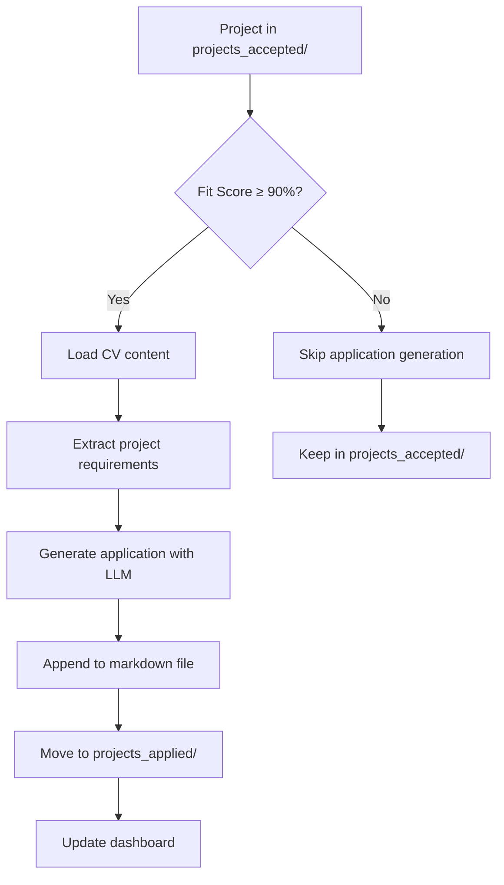

# Bewerbungs-Generator Integration Plan

## Overview
Integration of the legacy `bewerbung_generator_app` into the main bewerbungs-bot project with automated application generation workflow.

## Current State Analysis

### Existing Project Structure
```
bewerbungs-bot/
├── main.py                     # Main workflow orchestrator
├── config.yaml                 # Main configuration
├── cv.md                       # User's CV (not in git)
├── evaluate_projects.py        # Project evaluation logic
├── projects/                   # Temporary scraped projects
├── projects_accepted/          # Accepted projects (≥85% fit)
├── projects_rejected/          # Rejected projects (<85% fit)
├── projects_applied/           # Projects with applications generated
├── dashboard/                  # Dashboard system
└── bewerbung_generator_app/    # Legacy application generator
```

### Legacy bewerbung_generator_app Features
- Multi-provider LLM support (OpenAI, Anthropic, Google)
- German job application generation
- Token usage calculation and cost estimation
- Professional application structure (Einleitung, Qualifikationen, Schlusswort)
- Prompt template for CV-to-project matching

## Integration Requirements

### 1. Workflow Integration
- **Automatic Generation**: Projects in `projects_accepted/` with fit-score ≥90% automatically get applications generated
- **Manual Trigger**: Ability to generate applications for specific project files
- **File Processing**: Generated application appended to project markdown file as new section
- **File Movement**: Processed projects moved to `projects_applied/`
- **Dashboard Refresh**: Dashboard updated after application generation

### 2. Configuration Migration
- **Separate Config Section**: Create `application_generator:` section in `config.yaml`
- **Independent LLM Settings**: Allow different LLM provider/model for application generation
- **Configurable Thresholds**: Separate threshold for application generation (default: 90%)
- **German Application Template**: Migrate the existing German prompt template exactly as-is (tested and proven)

### 3. File Structure Changes
- **Input Source**: Use markdown files from `projects_accepted/` instead of `project_offer.txt`
- **CV Source**: Use `cv.md` instead of hardcoded CV file path
- **Output Format**: Append to existing markdown instead of creating new files

## Detailed Implementation Plan

### Phase 1: Configuration Setup
1. **Extend config.yaml structure**:
   ```yaml
   application_generator:
     enabled: true
     auto_generation_threshold: 90  # Only generate for projects ≥90% fit
     llm:
       provider: "Anthropic"        # Can be different from main LLM
       model: "claude-sonnet-4-20250514"
       api_key: "${ANTHROPIC_API_KEY}"
     template:
       salary_expectation: "120,- € pro Stunde"
       availability: "sofort, vollzeit, remote und vor Ort"
   ```

2. **Create configuration validation**
3. **Add backward compatibility checks**

### Phase 2: Core Integration Module
1. **Create `application_generator.py`**:
   - Migrate core functionality from legacy app
   - Adapt for markdown input/output
   - Implement multi-provider LLM support
   - Add project metadata extraction
   - Implement application text appending

2. **Key Functions**:
   ```python
   - load_application_config()
   - generate_application_for_project(project_file, cv_content, config)
   - append_application_to_markdown(project_file, application_text)
   - move_to_applied_folder(project_file)
   - calculate_application_cost(tokens, provider)
   ```

### Phase 3: Workflow Integration
1. **Extend main.py**:
   - Add application generation step after project evaluation
   - Add command-line option for manual application generation
   - Integrate with existing dashboard refresh

2. **Extend evaluate_projects.py**:
   - Store fit scores for application generation filtering
   - Add metadata for application generation decisions

3. **Command Line Interface**:
   ```bash
   # Automatic mode (with application generation)
   python main.py
   
   # Generate applications for specific projects
   python main.py --generate-applications projects_accepted/project1.md
   
   # Generate applications for all accepted projects
   python main.py --generate-applications --all-accepted
   
   # Skip application generation
   python main.py --no-applications
   ```

### Phase 4: Dashboard Integration
1. **Extend dashboard data structure**:
   ```json
   {
     "project_id": "...",
     "status": "applied",  // New status
     "application_generated": true,
     "application_date": "2025-01-15",
     "fit_score": 95,
     "application_cost": 0.045
   }
   ```

2. **Update dashboard HTML**:
   - Add "Applied" status filtering
   - Show application generation statistics
   - Display cost tracking for applications

### Phase 5: Cleanup and Migration
1. **Legacy Code Removal**:
   - Move useful components from `bewerbung_generator_app/`
   - Remove obsolete files and dependencies
   - Update documentation

2. **Dependencies Update**:
   - Merge requirements from legacy app
   - Remove duplicate dependencies
   - Ensure version compatibility

## Technical Specifications

### Application Generation Process


### Markdown File Structure
```markdown
# Original Project Title
[Original project content...]

## Project Evaluation
- **Fit Score**: 95%
- **Evaluation Date**: 2025-01-15
- **Status**: Accepted

## Generated Application
**Generation Date**: 2025-01-15 14:30:00  
**AI Provider**: Anthropic Claude Sonnet 4  
**Tokens Used**: 2,847  
**Estimated Cost**: $0.045

### Einleitung
Position: [Position from project]
Referenznummer: [Reference number]
[Introduction text...]

### Qualifikationen
[Detailed qualifications matching...]

### Schlusswort
[Conclusion with availability and salary...]

---
*Application generated automatically by Bewerbungs-Bot*
```

### Configuration Schema
```yaml
# Main configuration remains unchanged
llm:
  provider: OpenAI
  model: gpt-5-mini
  api_key: "..."

settings:
  acceptance_threshold: 85

# New application generator section
application_generator:
  enabled: true
  auto_generation_threshold: 90
  manual_generation: true
  
  llm:
    provider: "Anthropic"
    model: "claude-sonnet-4-20250514" 
    api_key: "${ANTHROPIC_API_KEY}"
    
  template:
    salary_expectation: "120,- € pro Stunde"
    availability: "sofort, vollzeit, remote und vor Ort"
    custom_sections:
      certifications_emphasis: true
      gap_analysis: true
      
  output:
    append_to_markdown: true
    include_metadata: true
    include_cost_tracking: true
```

## Implementation Timeline

### Week 1: Foundation
- [ ] Create enhanced configuration structure
- [ ] Build core application_generator.py module
- [ ] Implement LLM integration with multi-provider support

### Week 2: Integration
- [ ] Integrate with main.py workflow
- [ ] Extend evaluate_projects.py for fit score storage
- [ ] Implement command-line interface

### Week 3: Dashboard & Testing
- [ ] Update dashboard for application tracking
- [ ] Comprehensive testing of integrated workflow
- [ ] Performance optimization and error handling

### Week 4: Cleanup & Documentation
- [ ] Remove legacy bewerbung_generator_app
- [ ] Update documentation and README
- [ ] Final testing and deployment preparation

## Success Criteria
1. ✅ Seamless integration with existing workflow
2. ✅ Automatic application generation for high-fit projects
3. ✅ Manual trigger capability for specific projects
4. ✅ Generated applications appended to project files
5. ✅ Projects moved to projects_applied/ after processing
6. ✅ Dashboard reflects application status
7. ✅ Clean removal of legacy code
8. ✅ Comprehensive configuration in config.yaml
9. ✅ Cost tracking and token usage monitoring
10. ✅ Professional German application quality maintained

## Risk Mitigation
- **LLM API Changes**: Multi-provider support ensures redundancy
- **Configuration Complexity**: Validation and defaults prevent errors
- **File Processing Errors**: Robust error handling and logging
- **Cost Management**: Token limits and cost tracking
- **Quality Assurance**: Template testing and manual review options

## Post-Integration Benefits
1. **Streamlined Workflow**: Single command processes everything from scraping to application generation
2. **Cost Optimization**: Intelligent thresholds prevent unnecessary API calls
3. **Quality Control**: Configurable templates and manual override options
4. **Complete Tracking**: Dashboard shows full project lifecycle
5. **Maintainable Codebase**: Clean integration without legacy dependencies