# Multi-Channel, Provider-Aware Ingestion Concept

This document proposes a provider-aware, multi-channel ingestion and scraping concept to replace the discontinued RSS feed. It introduces an Email channel and a general architecture to support multiple providers, each with customized URL collection and scraping logic, all governed by configuration.

---

## 1) Objective and Scope

- Replace single-source RSS ingestion with a configurable, provider-aware, multi-channel system that:
  - Distinguishes providers consistently across ingestion, scraping, and storage.
  - Implements provider-specific URL collection and provider-specific scraping into standardized markdown.
  - Adds an Email channel that polls a mailbox, filters by sender/subject, extracts URLs, moves messages to a processed folder, and passes URLs to scraping.
  - Records the provider in the markdown frontmatter.
  - Exposes the provider in the UI and enables filtering by provider.

Non-goals:
- No implementation details or code plans in this document (concept only).
- No operational runbooks or infrastructure specifics.

---

## 2) Current Baseline (for context)

- Ingestion currently relies on RSS (discontinued for key providers).
- Scraping is tailored to a single provider (FreelancerMap) and outputs markdown, with a state manager adding frontmatter.
- Frontmatter today lacks a provider identifier, and the UI lacks a provider filter.

Gaps:
- Single source for URL discovery (RSS).
- Single parsing strategy for diverse provider HTML structures.
- No provider identity in stored artifacts or UI.

---

## 3) Problem Sources and Risks

Potential sources (7):
- Provider variability: Different DOM structures, labels, and navigation patterns.
- Channel fragility: RSS discontinuation; need alternate discovery (email/API/crawler/manual).
- Missing provider identity: No consistent provider field blocks analytics and filtering.
- Email complexity: MIME formats, forwarded chains, localized content complicate reliable URL extraction.
- Duplicate handling: URL-only dedupe without provider context risks collisions or misses.
- Config sprawl: Without structure, adding providers/channels becomes error-prone.
- UI/Backend contract: Provider filter requires backend-provided fields.

Most likely gaps to solve first:
- Provider abstraction for both URL collection and scraping adapters.
- Email ingestion pipeline that normalizes emails into URL lists per provider.

Validation logging to confirm assumptions:
- Per-channel ingestion logs (provider, channel, URL counts before/after dedupe).
- Adapter extraction coverage metrics (fields expected vs. found).
- Persistence checks ensuring provider presence in frontmatter.
- API/UI payloads include provider fields and yield distinct provider counts.

---

## 4) Target Architecture (Conceptual)

- Ingestion Manager (Channel Orchestrator)
  - Normalizes outputs from multiple channels (Email, RSS legacy, API polling, Sitemap/Catalog crawler, Manual/CSV import, Webhook) into URL batches annotated with provider_id and collection_channel.
  - Dedupe Service merges batches and removes already-processed URLs using provider-aware keys and canonicalized URLs.

- Provider Registry and Adapters
  - Registry maps provider_id → {channel collectors, scraping_adapter, normalization rules}.
  - Scraping adapters are provider-specific and output a unified project schema.
  - Markdown rendering is shared and fed from the normalized schema.

- Config-Driven Assembly
  - Single config defines channels and per-provider settings (credentials, filters, endpoints, selectors), enabling non-code onboarding for new providers.

- Processing Pipeline
  - Channel → URL batch (provider-tagged) → Dedupe → Scrape via provider adapter → Markdown → Frontmatter (incl. provider) → State Manager.

### Diagrams

Figure 1: Component Diagram
This diagram identifies the key components and their relationships. Channels feed the Ingestion Manager. The Ingestion Manager consults the Provider Registry to route to the correct Scraping Adapter. Results flow through the Markdown Renderer and State Manager into the Projects Store and UI Dashboard. The Scheduler triggers provider specific runs. Configuration informs orchestration and provider behavior.

```mermaid
graph LR
  %% Layout and styles
  classDef channel fill:#e3f2fd,stroke:#2196f3,color:#0d47a1,rx:6,ry:6
  classDef core fill:#e8f5e9,stroke:#43a047,color:#1b5e20,rx:6,ry:6
  classDef control fill:#fff3e0,stroke:#fb8c00,color:#e65100,rx:6,ry:6
  classDef storage fill:#f3e5f5,stroke:#8e24aa,color:#4a148c,rx:6,ry:6

  subgraph Channels
    Email[📨 Email Channel]
    RSS[📰 RSS Channel]
    API[🔌 API Channel optional]
    Crawler[🕷️ Crawler Channel optional]
    Manual[📝 Manual Import optional]
    Webhook[📡 Webhook Channel optional]
  end
  class Email,RSS,API,Crawler,Manual,Webhook channel

  subgraph Control
    Scheduler[⏱️ Scheduler]
    Config[⚙️ Configuration]
    Registry[📚 Provider Registry]
  end
  class Scheduler,Config,Registry control

  subgraph Processing
    Orchestrator[🧭 Ingestion Manager]
    Dedupe[♻️ Dedupe Service]
    Adapter[🧩 Scraping Adapter]
    Markdown[🖹 Markdown Renderer]
    State[🗂️ State Manager]
  end
  class Orchestrator,Dedupe,Adapter,Markdown,State core

  subgraph Storage and UI
    Store[🗄️ Projects Store]
    UI[📊 UI Dashboard]
  end
  class Store,UI storage

  %% Flows
  Email --> Orchestrator
  RSS --> Orchestrator
  API --> Orchestrator
  Crawler --> Orchestrator
  Manual --> Orchestrator
  Webhook --> Orchestrator

  Scheduler -- triggers --> Orchestrator
  Config -- settings --> Orchestrator
  Config -- providers --> Registry
  Orchestrator -- resolve provider --> Registry

  Orchestrator --> Dedupe
  Dedupe --> Adapter
  Adapter --> Markdown
  Markdown --> State
  State --> Store
  Store --> UI
```



Figure 2: System Architecture Flow
This flow shows the end to end path with harmonized names. All Channels converge into the Ingestion Manager, which resolves the provider via the Provider Registry and deduplicates before delegating to a Scraping Adapter. The result is rendered to markdown, persisted with frontmatter, and exposed to the UI Dashboard.

```mermaid
graph LR
  classDef step fill:#e8f5e9,stroke:#43a047,color:#1b5e20,rx:6,ry:6
  classDef node fill:#e3f2fd,stroke:#2196f3,color:#0d47a1,rx:6,ry:6

  Email[📨 Email Channel]:::node
  RSS[📰 RSS Channel]:::node
  API[🔌 API Channel optional]:::node
  Crawler[🕷️ Crawler Channel optional]:::node
  Manual[📝 Manual Import optional]:::node
  Webhook[📡 Webhook Channel optional]:::node
  Scheduler[⏱️ Scheduler]:::node
  Orchestrator[🧭 Ingestion Manager]:::step
  Registry[📚 Provider Registry]:::step
  Dedupe[♻️ Dedupe Service]:::step
  Adapter[🧩 Scraping Adapter]:::step
  Markdown[🖹 Markdown Renderer]:::step
  State[🗂️ State Manager]:::step
  Store[🗄️ Projects Store]:::node
  UI[📊 UI Dashboard]:::node

  Email --> Orchestrator
  RSS --> Orchestrator
  API --> Orchestrator
  Crawler --> Orchestrator
  Manual --> Orchestrator
  Webhook --> Orchestrator
  Scheduler --> Orchestrator

  Orchestrator -- resolve provider --> Registry
  Orchestrator -- dedupe request --> Dedupe
  Dedupe -- unique urls --> Orchestrator
  Orchestrator -- dispatch --> Adapter
  Adapter -- normalized schema --> Markdown
  Markdown -- frontmatter set --> State
  State -- persist --> Store
  Store -- projects with provider --> UI
```



Figure 3: Email to Project Sequence
This sequence uses harmonized names and adds annotations for clarity. The Email Channel emits provider tagged URLs. The Ingestion Manager deduplicates and resolves the provider to a Scraping Adapter via the Provider Registry, then renders markdown and persists the project for the UI Dashboard.

```mermaid
sequenceDiagram
  autonumber
  participant Email as 📨 Email Channel
  participant Orchestrator as 🧭 Ingestion Manager
  participant Registry as 📚 Provider Registry
  participant Dedupe as ♻️ Dedupe Service
  participant Adapter as 🧩 Scraping Adapter
  participant Markdown as 🖹 Markdown Renderer
  participant State as 🗂️ State Manager
  participant Store as 🗄️ Projects Store
  participant UI as 📊 UI Dashboard

  Note over Email: Poll IMAP, filter sender and subject, extract URLs
  Email->>Orchestrator: URL batch with provider_id and channel
  Orchestrator->>Dedupe: Deduplicate by provider_id and canonical_url
  Dedupe-->>Orchestrator: Unique URLs

  Orchestrator->>Registry: Resolve adapter for provider_id
  Registry-->>Orchestrator: Adapter handle

  alt Scraping succeeds
    Orchestrator->>Adapter: Scrape URLs with provider rules
    Adapter->>Markdown: Normalized project schema
    Markdown->>State: Markdown with frontmatter incl provider and channel
    State->>Store: Persist project and update indexes
    Store-->>UI: Projects with provider for filtering and display
  else Transient failure
    Orchestrator-->>Email: Log and retry policy applied
  end

  Note over UI: Provider visible and filterable in dashboard
```



---

## 5) Input Channels (Conceptual)

1) Email Agent
- Poll IMAP on interval; for each configured provider:
  - Filter by senders, subject patterns, and optional body keywords.
  - Extract URLs via per-provider body_url_patterns (regex list) robust to text/HTML bodies and forwarded chains.
  - Move processed emails to a provider-specific processed folder.
  - Emit deduped URL lists annotated with provider_id and collection_channel=email.
- Failure isolation: One malformed email does not block the batch.
- Observability: Counts per provider/folder, extraction rate, example URLs.

2) RSS (Legacy/Optional)
- Retained for providers still offering feeds; integrated via orchestrator.
- Provider mapping replaces global, single-provider logic.

3) API Polling (Optional - will be considered later)
- If a provider offers JSON APIs: periodic GET with authentication, pagination strategies, and backoff.
- Map items to canonical URLs; emit provider-tagged URL lists.

4) Sitemap or Catalog Crawler (Optional - will be considered later)
- Seed URLs with allowlist_patterns and depth limits; rate limiting as configured.
- Extract detail-page URLs; emit provider-tagged URL lists.

5) Manual or CSV Import (Optional - will be considered later)
- Accept a list of URLs with an explicit provider_id column; batch into the same pipeline.

6) Webhook Receiver (Optional - will be considered later)
- Endpoint to receive provider push notifications with URLs; normalize into batches.

---

## 6) Provider-Specific Scraping Adapters

Responsibilities:
- DOM selectors for title, description, metadata, keywords, and fields relevant to matching/evaluation.
- Label localization mapping (e.g., Projekt-ID vs. Project ID).
- Output to a unified schema; reuse a shared markdown rendering utility.
- Wrap extracted content sections using standardized labels aligned with the application generation labels to ensure consistent downstream processing and evaluation.

Standardized label wrapping example:
- Sections should be emitted under stable labels expected by downstream evaluation, for example:
  - Anforderungen
  - Aufgaben
  - Qualifikationen
  - Rahmenbedingungen
  - Kontakt

Example markdown body structure excerpt:
```
## Anforderungen
- Erfahrung mit Kubernetes und ArgoCD
- Kenntnisse in Terraform und AWS

## Aufgaben
- Aufbau und Betrieb von CI CD Pipelines
- Automatisierung von Deployments

## Qualifikationen
- Mindestens 5 Jahre Erfahrung in DevOps
- Deutschkenntnisse

## Rahmenbedingungen
- Start sofort
- Auslastung 100 Prozent
```

Resilience:
- Layered selectors and semantic fallbacks to tolerate minor DOM changes.
- Extraction metrics: fields_expected vs. fields_found, coverage percentage, warning counts.

---

## 7) Unified Project Schema and Markdown

Unified schema (core):
- title, company, reference_id, posted_date, location, workload, contract, tags, source_url, description.

Provider/Channel metadata:
- provider_id (short code, e.g., freelancermap, xyzjobs),
- provider_name (human-readable),
- collection_channel (email|rss|api|crawler|manual|webhook),
- collected_at (ISO timestamp).

Markdown frontmatter additions:
- provider_id: required,
- provider_name: optional but preferred,
- collection_channel: required,
- collected_at: required,
- existing fields remain (title/company/reference_id/source_url/state/etc.).

Body rendering:
- Preserve existing markdown sections.
- Normalize provider differences in the adapter before rendering.

---

## 8) Configuration Model (Concept)

Top-level configuration:
- channels:
  - email: IMAP connection, folders, polling interval, max_per_run, global safety limits.
  - api_polling: defaults (timeouts, retries, backoff strategies).
  - crawler: robots policy, concurrency, rate limits.
- providers.<provider_id>:
  - enabled: true (default)
  - channels:
    - email:
      - senders: [list]
      - subject_patterns: [regex]
      - body_url_patterns: [regex]
      - source_folder: "INBOX/…"
      - processed_folder: "Processed/<provider_id>"
    - rss:
      - feed_urls: [list]
    - api:
      - endpoint: URL
      - auth: headers/keys
      - params/pagination: strategy
    - crawler:
      - seeds: [urls]
      - allowlist_patterns: [regex]
      - max_depth: N
      - rate_limits: {rps, burst}
  - scraping_adapter: adapter_name
  - normalization:
    - locale: "de-DE" | "en-US" | …
    - field_mappings: label overrides
    - canonicalization: URL normalization rules

### Scheduler Integration
- The system must integrate with the Scheduler to create and manage separate schedules per provider.
- Each provider configuration is addressable by the Scheduler to define frequency, time windows, and channel selection for runs.
- The attribute `enabled` defaults to `true` to ensure providers appear as schedulable targets by default.
- Schedules can target channels per provider, e.g., email only for provider_a, rss for provider_b.

---

## 9) State, Dedupe, and Idempotency

- Dedupe key: (provider_id, canonical_url).
- Canonicalization: provider-specific rules (strip tracking params, normalize host/path).
- Idempotent ingestion: repeated emails or API pages must not duplicate projects.
- Safe retries: only re-queue failed URLs; apply exponential backoff and caps.

---

## 10) UI and Filtering

- Backend includes provider_id and provider_name per project in API payloads.
- UI changes:
  - Add Provider as a visible column and a multi-select filter.
  - Extend saved/quick filters to include provider selections.
- Analytics:
  - Dashboard aggregates by provider and collection_channel (counts, success rate, coverage).

---

## 11) Observability and Governance

Structured logs per provider/channel:
- ingest_start/ingest_end with counts and durations.
- email_extraction_summary: emails_scanned, matched, urls_extracted, moved_count.
- scraping_summary: fields_expected, fields_found, coverage_pct, adapter_version.
- persistence_summary: provider fields present in frontmatter; filenames and states.

Metrics and alerts:
- URLs/hour by provider/channel, success rate, extraction coverage.
- Alerts on zero-yield intervals, coverage dips vs. thresholds.

Audit:
- Correlate email message-id ↔ extracted URLs (store minimal headers, avoid raw bodies/PII).

---

## 12) Security and Compliance

- Secrets via environment variables; no credentials in config files.
- Least-privilege IMAP access and isolated folders.
- Terms-of-service compliance; prefer official APIs when offered.
- robots.txt compliance: not relevant at the moment.

---

## 13) Failure Modes and Safeguards

- Email parsing drift: maintain provider-specific regex suites; canary samples for regression detection.
- DOM changes: layered selectors and fallback heuristics; adapter versioning to track changes.
- API rate limits: adaptive backoff with jitter and quotas per provider.
- Duplicate spam: canonicalization + provider-aware dedupe.
- Config errors: schema validation at startup; dry-run mode to preview planned actions.

---

## 14) Minimal Viable Capability (Concept Only)

- Introduce a Provider Registry abstraction that binds providers to channel collectors and scraping adapters.
- Implement an Email channel blueprint (spec-driven, per-provider filters and URL extraction patterns).
- Add provider fields to markdown frontmatter and API payloads.
- Add provider filter and column to the UI.

This concept defines how to evolve from a single RSS-driven ingestion to a robust, provider-aware, multi-channel system with strong observability, configurability, and UI support, without prescribing implementation details.