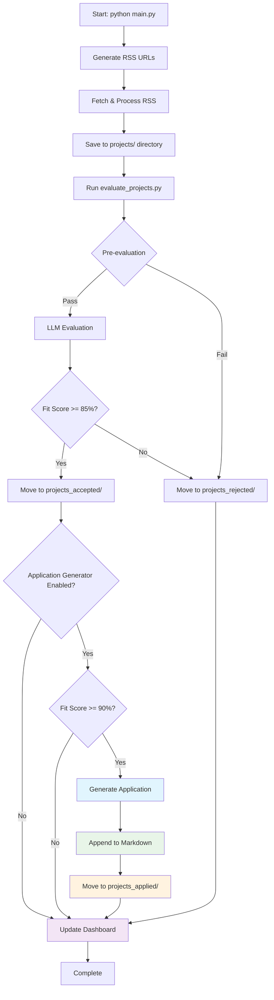
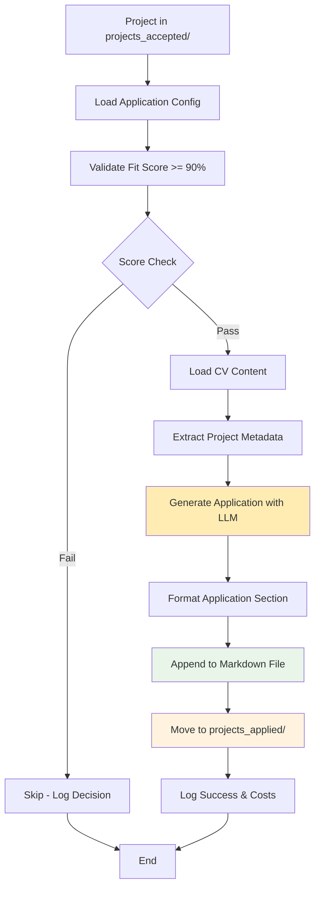
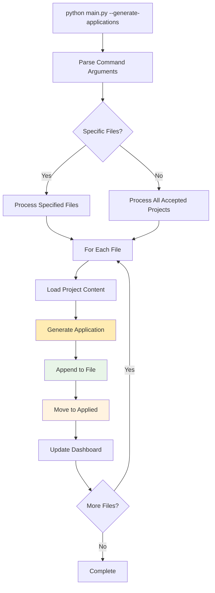
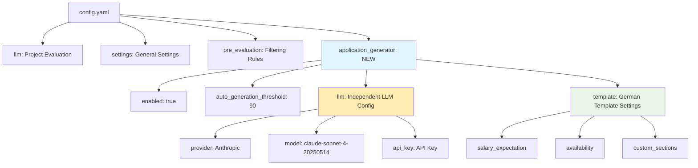
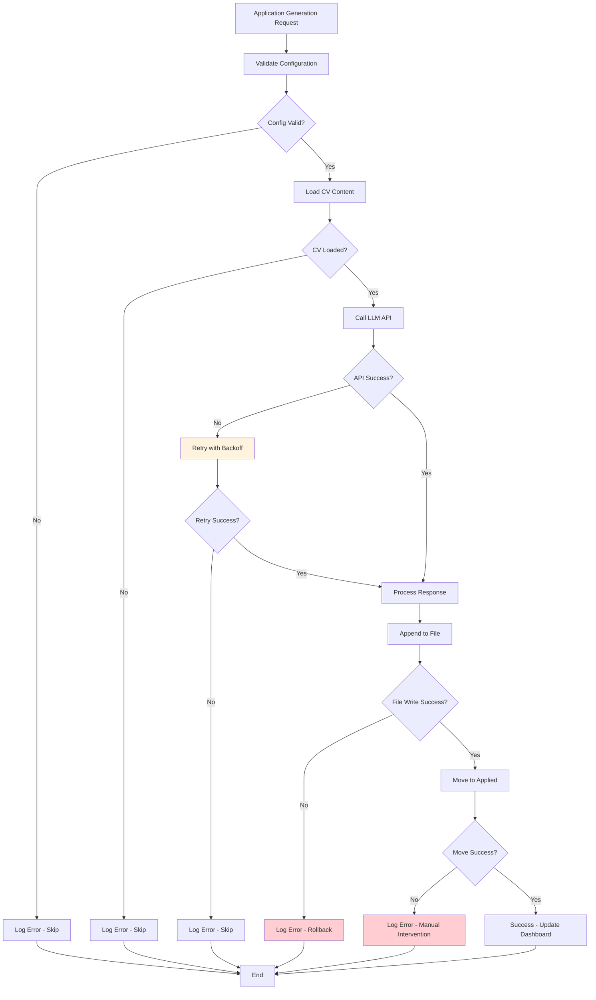

# Integrated Bewerbungs-Bot Workflow Diagram

## Complete System Flow



## Application Generation Detail Flow



## Manual Application Generation Flow



## File Structure Evolution

### Before Integration

```
bewerbungs-bot/
├── projects/                   # Temporary scraped projects
├── projects_accepted/          # Projects passing evaluation
├── projects_rejected/          # Projects failing evaluation
└── bewerbung_generator_app/    # Legacy standalone app
```

### After Integration

```
bewerbungs-bot/
├── projects/                   # Temporary scraped projects  
├── projects_accepted/          # Projects passing evaluation (fit ≥ 85%)
├── projects_rejected/          # Projects failing evaluation (fit < 85%)
├── projects_applied/           # Projects with applications (fit ≥ 90%)
├── application_generator.py    # Integrated application generator
└── [bewerbung_generator_app removed]
```

## Configuration Structure



## Dashboard Integration

### Current Dashboard Data

```JSON
{
  "project_id": "20250828_113258_project",
  "status": "accepted",
  "fit_score": 95,
  "file_path": "projects_accepted/project.md"
}
```

### Enhanced Dashboard Data

```JSON
{
  "project_id": "20250828_113258_project",
  "status": "applied",
  "fit_score": 95,
  "file_path": "projects_applied/project.md",
  "application_generated": true,
  "application_date": "2025-01-15T14:30:00",
  "application_cost": 0.045,
  "application_tokens": 2847,
  "application_provider": "Anthropic"
}
```

## Command Line Interface

### Automatic Mode (Default)

```Shell
python main.py                    # Full workflow with application generation
python main.py --no-applications # Skip application generation
```

### Manual Application Generation

```Shell
# Generate for specific projects
python main.py --generate-applications projects_accepted/project1.md

# Generate for all accepted projects  
python main.py --generate-applications --all-accepted

# Custom threshold
python main.py --generate-applications --threshold 95
```

## Error Handling Flow



## Integration Benefits

1. **Streamlined Workflow**: Single command processes from scraping to application generation
2. **Intelligent Filtering**: Only high-potential projects (≥90% fit) get applications
3. **Cost Management**: Separate LLM configuration prevents unnecessary costs
4. **Quality Control**: Professional German templates with CV matching
5. **Complete Tracking**: Dashboard shows full project lifecycle
6. **Flexible Usage**: Both automatic and manual application generation modes
7. **Robust Error Handling**: Graceful failures don't break the workflow
8. **Clean Architecture**: Legacy code removed, integrated functionality maintained

## Success Metrics

* **Automation**: 100% of qualifying projects get applications automatically
* **Quality**: Professional German applications with accurate CV matching
* **Performance**: <30 seconds per application generation
* **Reliability**: <1% failure rate with proper error recovery
* **Cost Efficiency**: Token usage optimized with intelligent thresholds
* **Usability**: Simple CLI and dashboard integration
