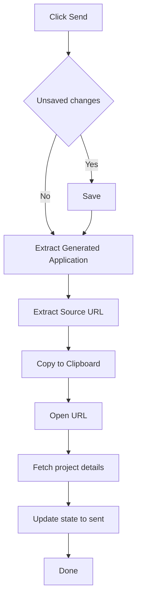

# ByteMD Markdown Editor Integration - Proposal

## Overview
Integrate ByteMD/Vue-next component to allow viewing, editing, and saving of markdown project files from the dashboard table. The editor will open in a new browser tab and work independently from the main dashboard.

## Architecture Design

### 1. Frontend Components
```
frontend/src/
├── views/
│   ├── Dashboard.vue (existing)
│   └── MarkdownEditor.vue (new - standalone editor page)
├── components/
│   └── ProjectTable.vue (modified - add edit button)
├── router/
│   └── index.js (modified - add editor route)
└── services/
    └── api.js (modified - add markdown file endpoints)
```

### 2. Backend API Extensions
```
server_enhanced.py (modified)
├── GET /api/v1/projects/{project_id}/markdown
├── PUT /api/v1/projects/{project_id}/markdown
```

### 3. Component Integration Flow
```mermaid
graph TD
    A[Dashboard Table] --> B[Edit Button Click]
    B --> C[Open New Tab: /editor/{project_id}]
    C --> D[MarkdownEditor.vue]
    D --> E[Fetch Markdown via API]
    E --> F[ByteMD Component]
    F --> G[User Edits Content]
    G --> H[Save Button]
    H --> I[PUT API Call]
    I --> J[Backend Saves File]
```

## Implementation Plan

### Phase 1: Backend API Enhancement
- [ ] Add markdown file read/write endpoints to `server_enhanced.py`
- [ ] Implement file validation and backup mechanisms
- [ ] Add error handling for file operations

### Phase 2: Frontend Infrastructure
- [ ] Install ByteMD dependencies (`@bytemd/vue-next`, plugins)
- [ ] Create new route `/editor/:projectId` in router
- [ ] Update API service with markdown endpoints

### Phase 3: Editor Component
- [ ] Create `MarkdownEditor.vue` component
- [ ] Integrate ByteMD with toolbar and preview
- [ ] Implement auto-save functionality
- [ ] Add save/cancel/close actions

### Phase 4: Table Integration
- [ ] Add "Edit" button to `ProjectTable.vue` action buttons
- [ ] Implement new tab opening logic
- [ ] Style the edit button consistently

### Phase 5: Testing & Polish
- [ ] Test file editing and saving
- [ ] Verify YAML frontmatter preservation
- [ ] Add loading states and error handling
- [ ] Cross-browser testing

## Technical Specifications

### Dependencies to Add
```json
{
  "@bytemd/vue-next": "^1.21.0",
  "@bytemd/plugin-gfm": "^1.21.0",
  "@bytemd/plugin-highlight": "^1.21.0",
  "@bytemd/plugin-frontmatter": "^1.21.0"
}
```

### Backend API Endpoints

#### GET /api/v1/projects/{project_id}/markdown
```python
@app.route('/api/v1/projects/<project_id>/markdown', methods=['GET'])
def get_project_markdown(project_id: str):
    """Get raw markdown content of project file"""
    # Return: {"content": "raw markdown", "filename": "...", "last_modified": "..."}
```

#### PUT /api/v1/projects/{project_id}/markdown
```python
@app.route('/api/v1/projects/<project_id>/markdown', methods=['PUT'])
def update_project_markdown(project_id: str):
    """Update markdown content of project file"""
    # Accept: {"content": "updated markdown"}
    # Return: {"success": true, "last_modified": "..."}
```

### Editor Component Features
- **ByteMD Integration**: WYSIWYG editor with live preview
- **Syntax Highlighting**: Code blocks with proper highlighting
- **YAML Frontmatter Support**: Preserve and validate frontmatter
- **Auto-save**: Periodic saves while editing
- **Conflict Detection**: Handle concurrent editing scenarios
- **File Validation**: Ensure file integrity before saving

### UI/UX Design

#### Edit Button in Table
- Icon: ✏️ (pencil)
- Position: In actions column after "View" button
- Behavior: `window.open('/editor/{projectId}', '_blank')`
- Tooltip: "Edit Markdown File"

#### Editor Page Layout
```
┌─────────────────────────────────────────────────────┐
│ [🏠 Back to Dashboard] [💾 Save] [❌ Close Tab]       │
├─────────────────────────────────────────────────────┤
│                                                     │
│  [ByteMD Editor with Toolbar]                       │
│  ├─ Source   ├─ Preview  ├─ Split View             │
│  │                                                  │
│  │  # Project Title                                 │
│  │  **URL:** [link](url)                          │
│  │  ## Details                                      │
│  │  - **Start:** value                            │
│  │  ...                                            │
│                                                     │
└─────────────────────────────────────────────────────┘
```

## Security & Validation

### File Safety
- Create backup copy before editing
- Validate YAML frontmatter structure
- Prevent malicious content injection
- File size limits and content validation

### State Management
- Preserve project state during editing
- Handle concurrent access gracefully
- Rollback mechanism for failed saves

## Benefits

### Simple Implementation
- Minimal code changes to existing codebase
- Leverages existing Vue 3 and Flask architecture
- Clean separation of concerns

### User Experience
- Independent editing environment
- Familiar markdown editing interface
- Real-time preview capabilities
- No disruption to main dashboard workflow

### Maintenance
- Uses mature ByteMD library
- Follows existing API patterns
- Easy to extend with additional features

## Future Enhancements (Optional)

### Advanced Features
- [ ] Collaborative editing support
- [ ] Version history and diff viewing
- [ ] Custom markdown extensions
- [ ] File templates and snippets
- [ ] Bulk editing capabilities

### Integration Improvements
- [ ] Inline editing mode (modal instead of new tab)
- [ ] Preview mode in main dashboard
- [ ] Quick edit shortcuts
- [ ] Advanced search and replace

## Estimated Development Time

| Phase | Effort | Description |
|-------|--------|-------------|
| Phase 1 | 4 hours | Backend API endpoints |
| Phase 2 | 2 hours | Frontend infrastructure |
| Phase 3 | 8 hours | Editor component |
| Phase 4 | 2 hours | Table integration |
| Phase 5 | 4 hours | Testing & polish |
| **Total** | **20 hours** | Complete implementation |

## Conclusion

This proposal provides a clean, simple solution for markdown editing that:
- ✅ Integrates ByteMD/Vue-next as requested
- ✅ Opens in new tab for independent editing
- ✅ Follows the playground example pattern
- ✅ Maintains existing architecture
- ✅ Keeps implementation simple
- ✅ Provides room for future enhancements

The solution balances simplicity with functionality, ensuring users can effectively edit their project markdown files while maintaining the integrity of the existing system.
## Proposal: Simple "Send" workflow in the Markdown Editor

Goal
- Add a "Send" button in the editor to:
  - Scan current Markdown content
  - Find "Generated Application" section
  - Copy it to clipboard
  - Open the source URL
  - Set project status to sent via state management

Scope
- All changes localized to [MarkdownEditor.vue](frontend/src/views/MarkdownEditor.vue:1)
- Reuse API and store already present:
  - [markdownApi.getProjectMarkdown()](frontend/src/services/api.js:45), [markdownApi.updateProjectMarkdown()](frontend/src/services/api.js:52)
  - [useProjectsStore().updateProjectState()](frontend/src/stores/projects.js:99)
  - [useProjectsStore().fetchProjectById()](frontend/src/stores/projects.js:89) to get status and URL if needed

UX
- Add "Send" button next to Save in the header of [MarkdownEditor.vue](frontend/src/views/MarkdownEditor.vue:30)
- Button state: enabled unless saving; shows small spinner/emoji only if desired (keep minimal)
- On click:
  1) If unsaved changes, prompt to save; on confirm, save then continue
  2) Extract Generated Application section from current editor content
  3) Copy extracted text to clipboard
  4) Find and open Source URL in a new tab
  5) Transition project status to sent using store

Parsing heuristics
- Generated Application block:
  - Prefer: from /^##\\s*Generated Application.*$/ to next heading of same or higher level or EOF
  - Fallbacks: /^###\\s*Application.*$/, or comment markers if present
- Source URL:
  - Prefer: a line like /^Source URL:\\s*(https?://\\S+)/i
  - Fallback: first URL in document
  - Final fallback: project detail field from [fetchProjectById()](frontend/src/stores/projects.js:89) such as source_url or url

State transition
- Read project via store when sending to get current status
- Call [updateProjectState(id, from, 'sent', 'Auto: sent from editor', false)](frontend/src/stores/projects.js:99)

Clipboard and window handling
- Use navigator.clipboard.writeText with fallback (hidden textarea + document.execCommand('copy'))
- Open URL synchronously during click handler (before awaiting async calls) to reduce popup blocking

Minimal error handling
- If Generated Application not found: alert and abort
- If URL missing: copy application text, alert about missing URL, skip opening
- If clipboard fails: alert but still try opening URL and updating state
- If state update fails: alert and log

Mermaid


Todo (implementation-ready)
1) UI
- Add "Send" button in header of [MarkdownEditor.vue](frontend/src/views/MarkdownEditor.vue:30) calling sendApplication()

2) Helpers (in same file to keep simple)
- add extractGeneratedApplication(markdown) as a function
- add extractSourceUrl(markdown) as a function

3) Logic in sendApplication() within [MarkdownEditor.vue](frontend/src/views/MarkdownEditor.vue:74)
- If hasChanges: confirm then await [markdownApi.updateProjectMarkdown()](frontend/src/services/api.js:52), update originals
- const appText = extractGeneratedApplication(markdownContent)
- const srcUrl = extractSourceUrl(markdownContent) || (await [useProjectsStore().fetchProjectById()](frontend/src/stores/projects.js:89)).source_url || .url
- Copy to clipboard (with fallback)
- If srcUrl: window.open(srcUrl, '_blank')
- const project = await [useProjectsStore().fetchProjectById(projectId)](frontend/src/stores/projects.js:89)
- await [useProjectsStore().updateProjectState(projectId, project.status, 'sent', 'Auto: sent from editor', false)](frontend/src/stores/projects.js:99)

4) Keep console logs; use alert() for critical failures only

Assumptions to confirm
- Section heading label is exactly "## Generated Application"
- Project details JSON has a field for the source URL: source_url or url
- Transition from applied to sent is allowed by backend; if not, we do not force

Acceptance criteria
- "Send" appears and works end-to-end: copy, open URL, set status to sent
- Graceful handling if section or URL missing
