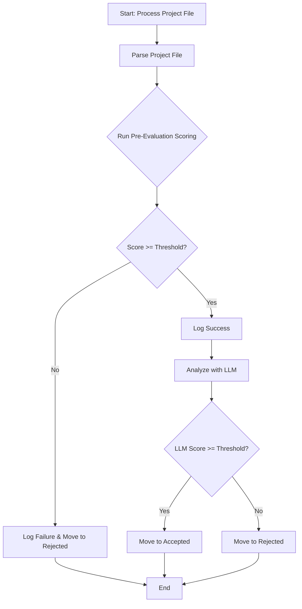

# Plan for Pre-Evaluation Implementation (v2)

This plan details the steps to add a local, weighted pre-evaluation filter to the `evaluate_projects.py` script. The goal is to quickly score projects based on keywords and reject those that don't meet a minimum threshold, all before sending them to the LLM for a full analysis.

### 1. Enhance Configuration

- **Action:** Update the `pre_evaluation` section in `config.yaml`.
- **Details:** This section will define the scoring rules:
    - `acceptance_threshold`: A percentage (0-100) that a project must meet to pass pre-evaluation.
    - `required_tags`: A list of tags that **must** be present. If any are missing, the score is 0.
    - `weighted_tags`: A dictionary where keys are tags and values are the points awarded for finding that tag (e.g., `{'Python': 20, 'AWS': 15, 'Remote': 10}`).
    - `forbidden_tags`: If any of these keywords are found, the project is immediately rejected with a score of -1.

### 2. Implement Weighted Scoring Logic

- **Action:** Create a new Python function, `pre_evaluate_project`, in `evaluate_projects.py`.
- **Details:**
    - The function will take the project's text content and the `pre_evaluation` config dictionary as input.
    - It will first check for `forbidden_tags`. If found, it returns a score of -1.
    - It will then check for all `required_tags`. If any are missing, it returns a score of 0.
    - It will then calculate a total score by summing the points from `weighted_tags` found in the text.
    - The maximum possible score will be calculated by summing all positive weights in `weighted_tags`.
    - The final fit score will be `(total_score / max_score) * 100`.
    - It will return a tuple: `(fit_score: int, rationale: str)`.

### 3. Integrate into the Main Processing Workflow

- **Action:** Modify the `process_project_file` function in `evaluate_projects.py`.
- **Details:**
    - After parsing the project content, call `pre_evaluate_project`.
    - The function will return the calculated `pre_evaluation_score`.
    - If the `pre_evaluation_score` is below the `pre_evaluation.acceptance_threshold`, the project is rejected.
    - If it passes, the process continues to the LLM analysis.

### 4. Update Logging

- **Action:** Enhance log messages for the pre-evaluation step.
- **Details:** Log the pre-evaluation score, the threshold, and the outcome to ensure the process is transparent.

### Mermaid Diagram of the Updated Workflow

    