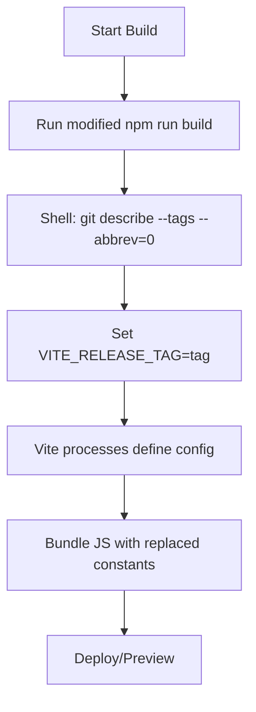

# Proposal: Integrate GitHub URL and Release Tag into Frontend at Build Time

## Overview

The frontend (Vue.js with Vite) will embed the static GitHub project URL and the current git release tag as build-time constants. This ensures the information is available in the bundled app without runtime fetches, improving performance and offline usability.

* **GitHub URL**: Static value `https://github.com/andreaswittmann/project-bot`, injected via Vite config.
* **Release Tag**: Dynamically fetched from local git repo using `git describe --tags --abbrev=0` (latest tag). Set as env var during build.
* **Access**: Use `import.meta.env.VITE_GITHUB_URL` and `import.meta.env.VITE_RELEASE_TAG` in Vue components.
* **Display**: Add a footer in `App.vue` or `Dashboard.vue` showing "Project: \[release tag] | GitHub: \[URL]".

This approach leverages Vite's `define` for replacement at build time, avoiding bundle bloat.

## Benefits

* Build-time integration: No API calls needed at runtime.
* Versioned builds: Each release gets the correct tag baked in.
* Simple: Minimal changes to existing setup.

## Potential Challenges

* Git must be available during build (e.g., in CI/CD, ensure repo is cloned with tags).
* Fallback: If no tag found, default to "dev" or commit hash.

## Build Flow Diagram

## Todo List

1. Update `frontend/package.json`: Modify "build" script to fetch git tag and export as env var (e.g., using cross-env or shell).
2. Update `frontend/vite.config.js`: Add `define` object with `VITE_GITHUB_URL` (static) and `VITE_RELEASE_TAG` (from env).
3. Update `frontend/src/App.vue` or create a new Footer component: Import and display the constants (e.g., in a footer div).
4. Test build: Run `npm run build` in frontend/, verify constants in dist/index.html or built JS.
5. Verify display: Run `npm run preview`, check footer shows correct URL and tag.
6. Document in README.md: Add section on build-time env vars.

This plan is concise and actionable. Next steps: Implement in code mode.
