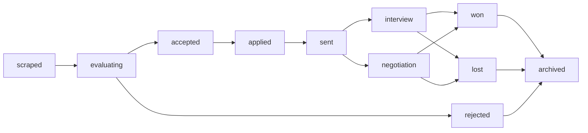

# Enhanced State Management Plan - Markdown Frontmatter Approach

## Overview
Replace directory-based state management with YAML frontmatter in markdown files. Keep directories for organization but use frontmatter as source of truth.

## Project Lifecycle States



## State Definitions

| State | Description | Next States |
|-------|-------------|-------------|
| `scraped` | Newly scraped project | `evaluating` |
| `evaluating` | Being processed by AI | `accepted`, `rejected` |
| `rejected` | Failed evaluation criteria | `archived` |
| `accepted` | Passed evaluation, ready for application | `applied` |
| `applied` | Application generated | `sent` |
| `sent` | Application submitted to client | `interview`, `negotiation` |
| `interview` | In interview process | `won`, `lost` |
| `negotiation` | In contract negotiation | `won`, `lost` |
| `won` | Project awarded | `archived` |
| `lost` | Project not awarded | `archived` |
| `archived` | Final state for cleanup | - |

## Frontmatter Schema

```yaml
---
# Project Metadata
title: "Project Title"
company: "Company Name"
reference_id: "REF123456"
scraped_date: "2024-01-15T10:30:00Z"
source_url: "https://example.com/project"

# State Management
state: "accepted"
state_history:
  - state: "scraped"
    timestamp: "2024-01-15T10:30:00Z"
    note: "Initial scraping"
  - state: "evaluating"
    timestamp: "2024-01-15T10:35:00Z"
    note: "Starting AI evaluation"
  - state: "accepted"
    timestamp: "2024-01-15T10:40:00Z"
    note: "Fit score: 87% - Above threshold"

# Evaluation Results
fit_score: 87
evaluation_notes: "Strong match for AWS/AI skills"
threshold_used: 85

# Application Status (if applicable)
application_generated: true
application_date: "2024-01-15T11:00:00Z"
tokens_used: 1500
generation_cost: 0.023

# Business Tracking
expected_rate: "120€/hour"
project_duration: "3 months"
location: "Remote/Berlin"
priority: "high"
---

# Project Content starts here...
```

## Implementation Changes

### 1. State Manager Class
Create `ProjectStateManager` to handle state transitions:
- Read/write frontmatter
- Validate state transitions
- Maintain state history
- Query projects by state

### 2. Modified Workflow Components

#### Project Scraper (`parse_html.py`)
- Add initial frontmatter with `state: "scraped"`

#### Project Evaluator (`evaluate_projects.py`)
- Update state to `evaluating` → `accepted`/`rejected`
- Add evaluation results to frontmatter
- Keep files in original location

#### Application Generator (`application_generator.py`)
- Update state to `applied` when generation starts
- Add application metadata to frontmatter
- Keep files in current location

#### File Purger (`file_purger.py`)
- Query by state instead of directory
- Archive only `archived` state projects
- Purge based on state age, not file location

### 3. Directory Structure (Simplified)
```
projects/                 # All projects in single directory
├── project_001.md       # state: "accepted"
├── project_002.md       # state: "sent"
└── project_003.md       # state: "archived"

projects_backup/         # Optional backup directory
logs/                    # Unchanged
dashboard/              # Enhanced with state filtering
```

### 4. New Management Commands

Add to `main.py`:
- `--state-list` - List projects by state
- `--state-transition` - Manual state changes
- `--state-report` - State distribution report

## Benefits

✅ **Simplicity**: No file moving, single source of truth  
✅ **Audit Trail**: Complete state history in each file  
✅ **Portability**: Self-contained project files  
✅ **Query-able**: Easy filtering by state/metadata  
✅ **Manual Override**: Easy to edit states manually  
✅ **Backward Compatible**: Existing files can be migrated

## Migration Strategy

1. Add `ProjectStateManager` class
2. Create migration script for existing projects
3. Update workflow components one by one
4. Test thoroughly with sample projects
5. Deploy and monitor

## File Organization Options

**Option A: Single Directory**
- All projects in `projects/`
- Use state for filtering

**Option B: Hybrid Approach**
- Keep current directories for visual organization
- Use frontmatter as authoritative state
- Directories become "views" not "state containers"