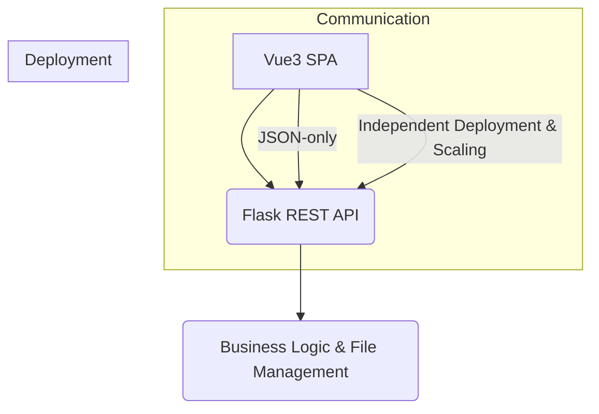
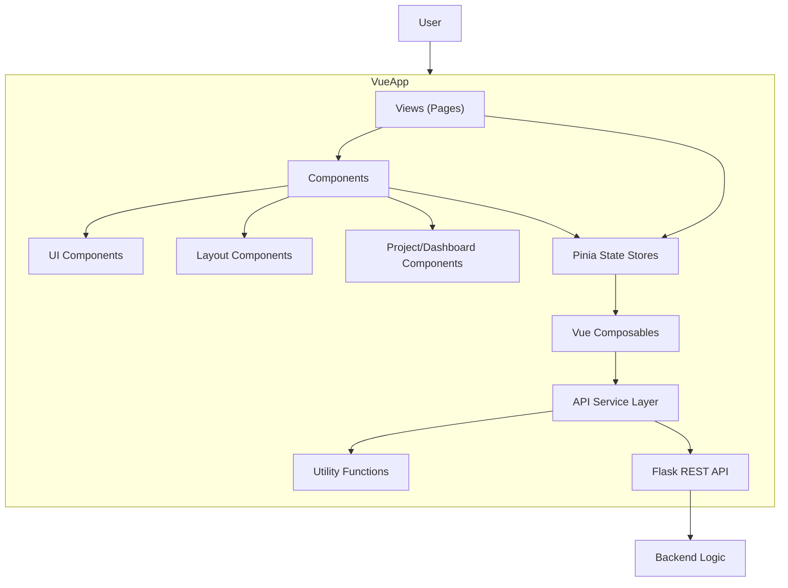
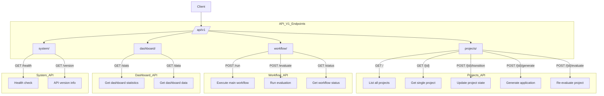
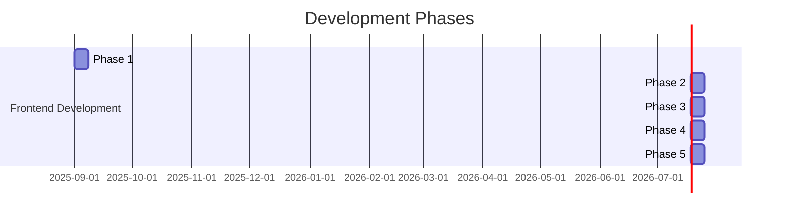

# Vue3 Frontend Architecture Concept - Diagrams

This document illustrates the key concepts of the Vue3 Frontend Architecture using Mermaid diagrams.

## 1. System Overview: Backend-for-Frontend Pattern

**Explanation:** This diagram illustrates the Backend-for-Frontend (BFF) pattern where the Vue3 Single Page Application communicates exclusively with a dedicated Flask REST API. The API handles all business logic and file management, enabling independent deployment and scaling of frontend and backend components. Communication is strictly JSON-based for clean separation of concerns.

## 2. Vue3 Frontend Architecture: High-Level Component Interaction

**Explanation:** This diagram shows the internal structure of the Vue3 SPA, illustrating how views (pages) interact with reusable components, which are further broken down into UI, layout, and project-specific components. It demonstrates the data flow from views through Pinia state stores to Vue composables, then to the API service layer and utility functions, ultimately connecting to the Flask REST API.

## 3. Flask Backend API Redesign: RESTful API Structure

**Explanation:** This diagram outlines the redesigned RESTful API structure with versioned endpoints (/api/v1/) organized into logical groups: projects, workflow, dashboard, and system. Each group contains specific HTTP methods for CRUD operations, workflow execution, and system monitoring, providing a comprehensive API for frontend-backend communication.

## 4. Development Phases

**Explanation:** This Gantt chart shows the phased development approach for the frontend, breaking down the project into 5 sequential phases: Foundation (setting up the basic structure), Core Components (building essential UI elements), Integration (connecting frontend to backend), Enhancement (adding advanced features), and Testing & Deployment (final validation and release).
